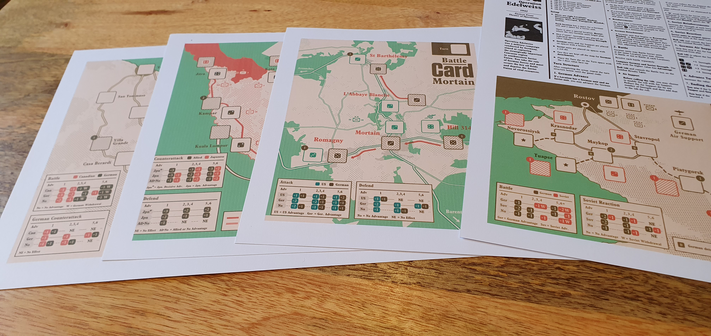
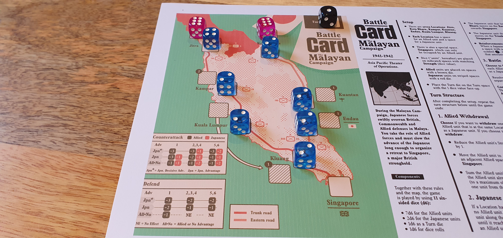
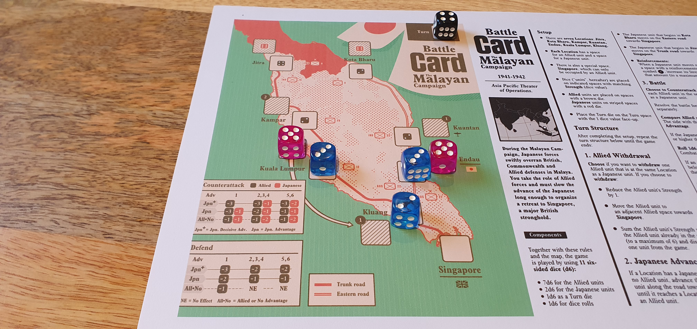

Bought the Battle Card from the [Postmark Games](https://www.postmarkgames.com/battle-card) for £4.

I was initially hesitant in trying Battle Card after reading about the lack of player agency, but after trying their free Market Garden map which acts as an introduction to the series I was pleasantly surprised by a simple yet effective simulation of historical battles.

### Official Description

_Take on iconic battles and campaigns of the Second World War in this collection of micro solitaire wargames. Each game is played on a single map with scenario specific rules that allow players to face some of the unique challenges and struggles of that particular battle._

### Components

Battle Card is the newest game series from Postmark Games and is solo only. The first series currently consists of 4 maps at time of review with another map coming in the future. The maps cover battles within the Second World War with each of these sharing common mechanics along with unique mechanics and rules based on the events of that battle such as reinforcements, air support or weather.

Each map is available for print and play only with A4 and US letter versions. To play you also need a selection of coloured dice, ideally with two separate colours to indicate the sides of the battles. Eleven dice are required to play all of the maps.

An additional map based on [Market Garden](https://boardgamegeek.com/filepage/265900/battle-card-market-garden-v2-color) is available for free and is recommended to learn how their game system works. The following paid maps each increase in complexity with more dice and mechanics to utilise.

### Gameplay

Winning a map normally requires capturing or retreating to a certain location, sometimes defeating a number of enemies is also an option. While losing involves reaching a certain number of turns or losing your units making every decision have a big impact.

Units are represented on the map as dice with their values indicating their strength. The combat can differ slightly between maps but the core mechanic is that you roll a dice for each unit as they attack or defend against the closest enemy. The result of the rolled die matches a combat result on the map’s combat table, with different outcomes depending on which unit has a dice value advantage. Often you are given the options to advance or withdraw units, this becomes one of the most impactful choices you make as you strategically reposition to get the best combat advantage. After the combat actions there are often mechanics for weather or reinforcements depending on the map to spice up each game.

I think at this point it's best to address the player agency problem that is often the main discussion about this game. While yes this isn’t a full war simulation due to the size and low complexity of the game, I would identify the aim of the game as to understand what actions had to be completed within the actual historical battle to win. I found that after losing or winning a map I knew what actions had resulted in the outcomes of the battle. Though this presents this issue of that once you win a map you know how to repeat that win with only a few potential differences based on the randomness of the dice rolls.

While the difficulty and complexity increases in each map if playing in release order. I found that the third and fourth maps had a much higher chance of being ruined during to bad luck at the beginning with any attempts to recover being near impossible due to the early loss of units.

The fourth map was recently released at time of review with the final map in series 1 being released in the future, but Postmark Games rarely communicates the status of upcoming content outside of vague messages in their Discord server.

Each map also includes historical notes explaining the history of the battle and how the objective of this map was influenced by the battle's events.

### Conclusion
