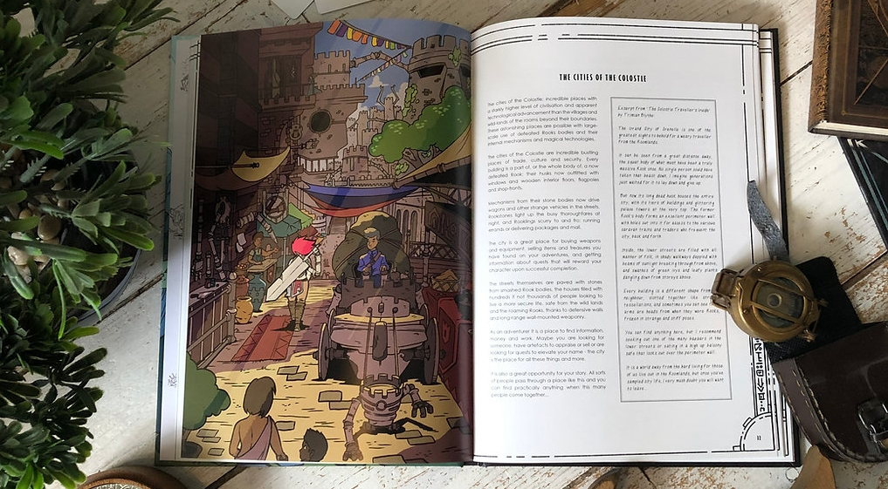
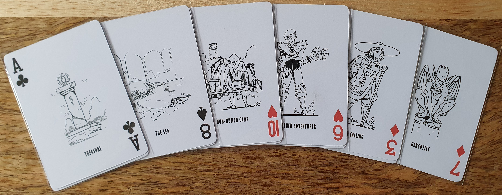
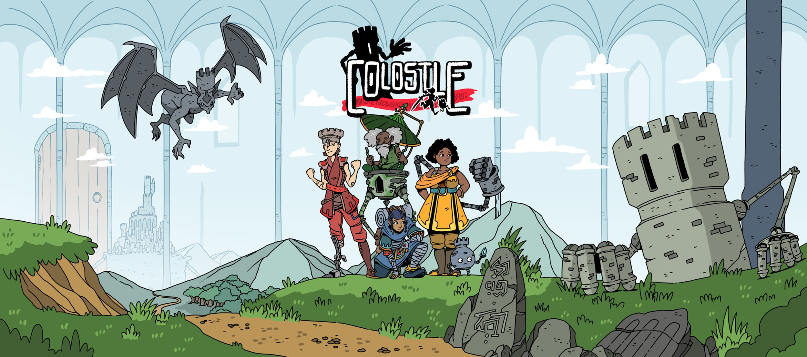
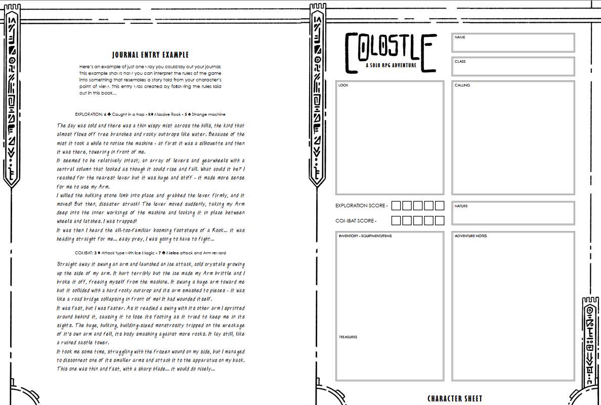
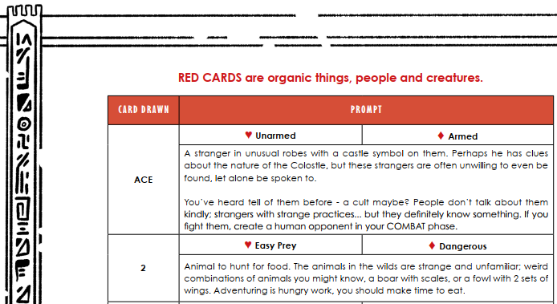
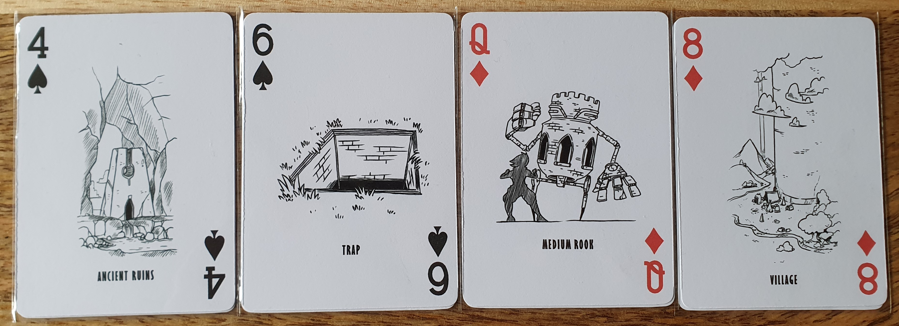
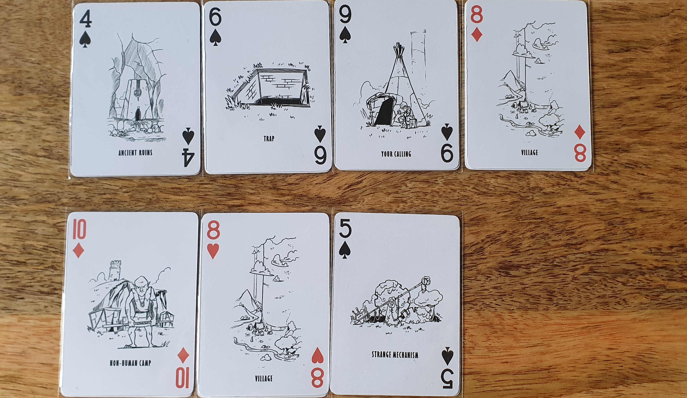
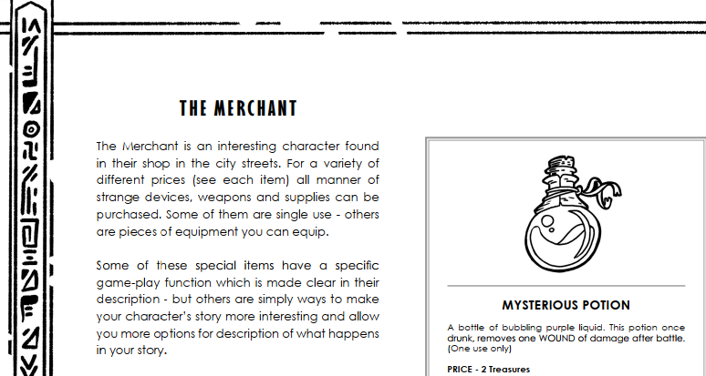
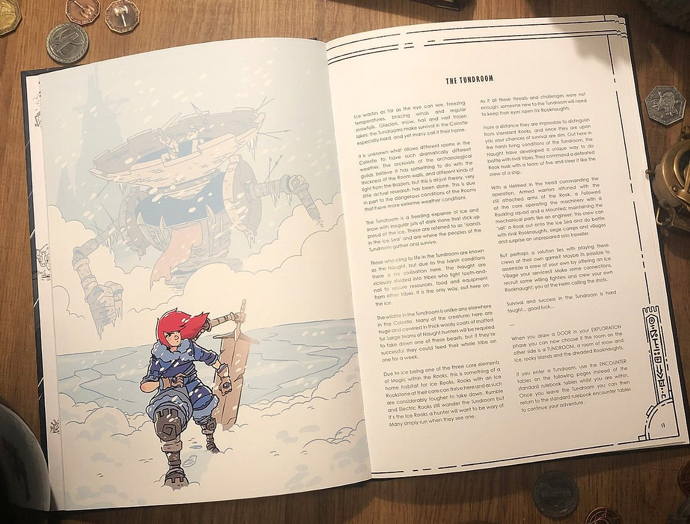
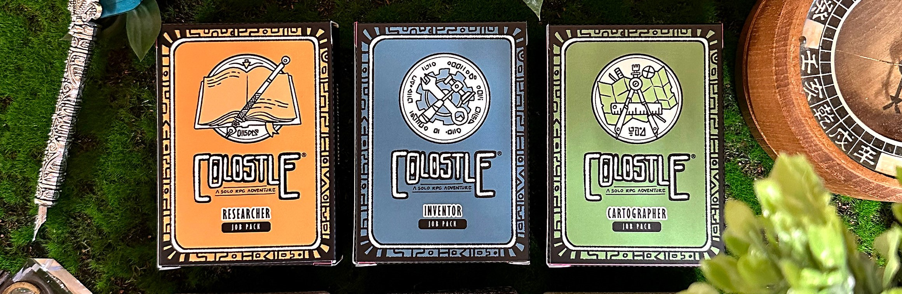

Bought the digital version of Colostle from the [official store](https://www.colostle.com/product-page/colostle-digital-content-pack) for £8.

I had yet to find a solo journaling game that really worked for me, until I tried Colostle.

### Official Description

_Colostle is a rulebook and setting for an adventure in the impossible roomlands of the Colostle, a castle so huge that whole continents, oceans and mountain ranges sit within its rooms. Use a standard deck of playing cards and check your draws against prompts and rules in the book to see what you discover on your adventures, and then write of your exploits and legend in a journal._

### Components

Playing Colostle requires any journal and a deck of generic playing cards, though using their custom card deck is more thematic. I preferred this as you receive a printable deck after buying the digital version with simple yet expressive art. The rulebook is available as a PDF or physical book directly from the official site but it might be available with quicker delivery from other sites.

### World

The key to any roleplaying game is the setting and themes of the game, though many can feel derivative. But Colostle hits it perfectly here, you live in a huge room within a massive castle that seems almost endless. Within each room there can be many biomes containing mountains, oceans, forests, cities and much more. Huge doors and passageways provide connections between the rooms, with a map showing a layout of the canon rooms within the world. The rest of the game is mostly traditional High fantasy with some magic and creatures such as goblins. But Colostle also introduces chess rooks that acts as automatons wondering the rooms and potentially even fighting you, these can be as large as buildings. I found these really helped cement the game's setting especially as I played as a the followed class which has a small rook known as a rookling acting as pet and ally on your adventures.

### Gameplay

Gameplay involves exploration potentially followed by a combat phase depending on the result of the exploration such as if you decide to attack or evade an enemy. This is a continuous loop until you decide to finish or your character is killed. Your overarching goal for your journey is generally based upon your character’s calling which is randomly chosen or decided upon during character creation. This gives a general aim, though it isn’t always relevant during every exploration phase.

The class you pick adds a theming to your character and helps build your backstory. But also changes how many cards you can draw during exploration and combat. A high exploration class will have more things happen during exploration such as locations, events, people etc. You are free to interpret the cards however you like in any order, such as a village being attacked by a rook or a village inside of a rook. This helps guide the gameplay while letting you use your imagination. Each card has tables describing what they mean with different impacts depending on the card colour.

Some cards might have additional cards drawn, such as types items you might pickup. This results in some exploration phases being fairly simple while others could have a complex chain of events. For example during one exploration my character was caught and imprisoned in a goblin village in a deep valley as massive rooks fought nearby, resulting in a medium rook being scared into rampaging through the valley destroying the village and damaging our cage. This injured my character with an exploration wound but helped us escape into a complex network of tunnels that the goblins had been exploring.

Combat is fairly simple, which may put off players expecting more complex and challenging combat. First you create the create which can be another person or a rook, these each have their own smaller tables to generate how they fight. Enemies will draw a certain number of cards based on their strength and size then you draw cards based on your combat score. Next you need to play one of your cards to counter the next card the enemy plays, this is ideally of a higher card value to win that combat. If you lose combat you take a wound against your exploration or combat score. You continue to fight until the opponent has used all of their cards.

To win against the opponent you need to win a majority of the attacks. If either of your scores reaches zero then that character has been killed. This does add some danger to your adventures, but I generally found it easy to heal wounds and avoid combat during exploration if a fight felt like it would be dangerous such as fighting against massive rook.

Throughout your adventures you will find many rooms with various biomes and locations. Including villages, cities, oceans and whatever your mind can come up with. Cities provide shops, the hunters guild, homes and many useful amenities. The exploration tables for the cards are the same regardless of biome and location unless you are exploring the oceans which have their own set of tables and encounters. I think the lack of biome specific encounters is one of the few problems with the base game but is improved upon by new biomes and encounter tables in the expansions.

Your journey continues until you complete your calling and decide to finish your character there or your character becomes lost due to having enough wounds to reduce a exploration or combat score to zero. This means your time spent on a single character will likely go on for many hours, compared to a shorter experience in games such as Notorious. Colostle doesn't have an action mode like Notorious but your game length will mainly depend on how long you spend writing as I can often write at least an A4 page for a single exploration phase.

So far this is the only solo RPG that I’ve been able to get into. I think its mainly due to the focus on world-building without complicated mechanics, letting your imagination run wild based on simple prompts from your cards. It's often like solving a puzzle of your creation when connecting the cards, with no wrong option.

### Settlements

Most locations your come across on your adventures won't provide any mechanical benefits apart from cities. There are no pre-designed cities in the base game but there are various tables to help design the city. Working out the placement of locations and amenities such as merchants, taverns, hunting guild, homes you can buy. As you adventure you will collect treasures that can be traded in for items at merchants or saved up to purchase a home. Homes not only provide a place for your character to rest for healing wounds but also enables fast traveling back to the city instead of relying on luck during exploration to find a city card. While the items from merchants provide roleplaying and mechanic driven benefits to aid in exploration and combat.

### Battlements

The book tries to keep the Battlements as a spoilers as it is meant for later in the game game, so I'll keep any details brief here. The Battlements acts as a new biome with a much higher difficulty so adventuring up there is dangerous and requires exploring for sometime before you will be able to travel there.

### Roomlands Expansion

Roomlands is the first of many expansions, but will be covered in a separate review. It adds new classes, locations, a named city and a guided story. It is a great addition but I would recommend playing some of the base game first before picking this up.

### Jobs Expansions

Three jobs are currently available via separate job decks available to buy or print. These jobs don’t impact your class but add unique mechanics for cartography, inventing and researching. These will spice up your adventure but again I would recommend playing some of the base game first before picking this up.

### Colostle Patreon

There is a patreon available for £2 a month, with monthly posts adding new art, locations and all kinds of content to aid in your Colostle adventure. This content is often part of the next expansion so it acts as a way to see what is coming up while being in bite sized pieces. There is also a Discord channel open for the everyone where you can ask questions or talk with other players.

### Multiplayer

While the base game does not support multiplayer, the Roomlands Expansion includes a 2-player module that I have yet to try.

### Conclusion
