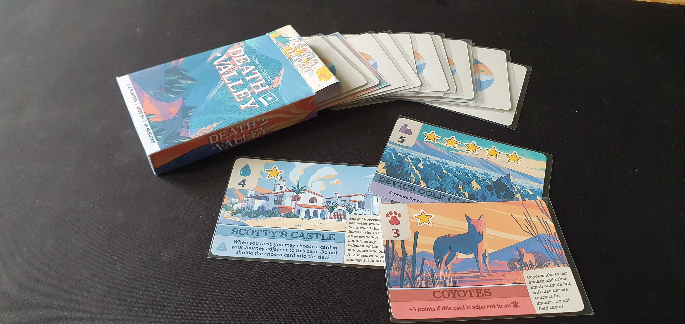
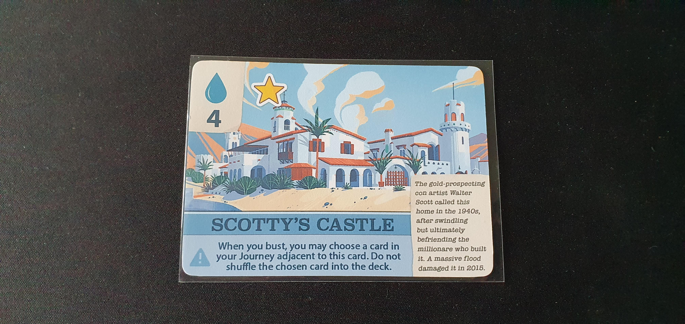
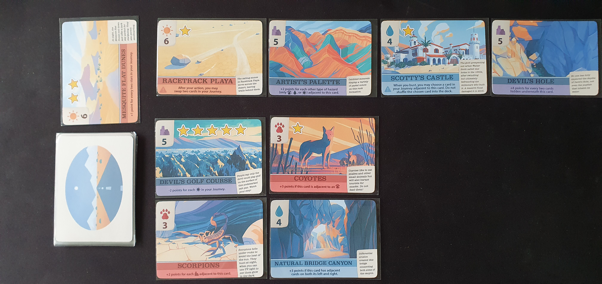
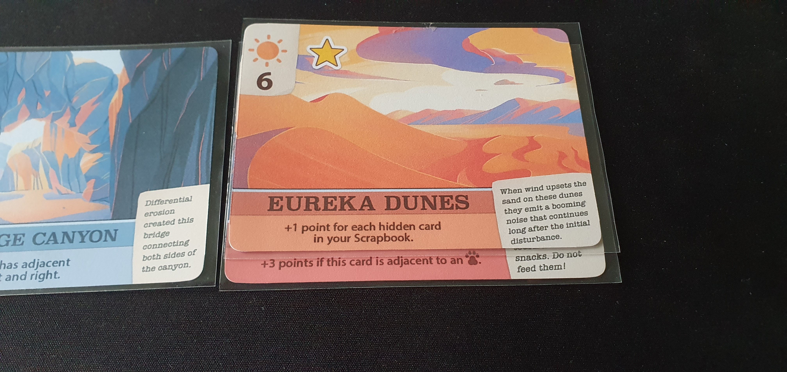
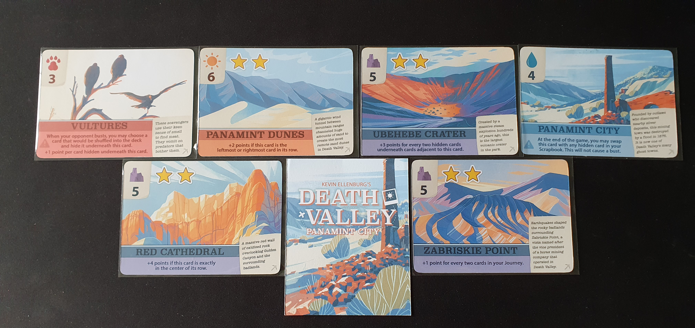

I reviewed the print and play version from [PNP Arcade](https://www.pnparcade.com/products/death-valley) for $3.

Official Description: Death Valley is a pocket-sized, push-your-luck, tableau-building game for 1-2 players, with each traveler striving to assemble the best mix of cards in their journey and scrapbook in order to win the game. Designed by Kevin Ellenburg.

### Components

Death valley like other Button Shy Games, consists of 18 cards with only one side with gameplay content. Each card has great art based on the real life aspect of Death Valley it represents along with the card name, number of stars (points), tableau mechnic, card type, and details on the real aspect of the card.

With the physical version it comes with a wallet to store the cards, while for my print and play version I assembled a tuckbox from BoardGameGeek.

### Gameplay

Death valley comes with 2 multiplayer modes and a solo mode that is the focus of this review. The bot in the solo mode is easy to use and helps give the game a very consistent play length making it a great choice during lunch breaks.

You shuffle and draw deck and play the top card as a faceup desert card. In each turn you can choose between playing the top facedown card from the deck or the desert card into your journey. Your journey contains cards you can score from but you have to be careful to avoid busting by having 3 cards of the same type, this causes you to clear your journey of cards and put the card that caused the bust into your discard pile. The other option is to rest by moving a card from your journey into your scrapbook to keep it safe as they cannot be lost due to busting with the downside of scrapbook cards not scoring for stars. This gives great push your luck where busting can cause huge consequences. You can also hide journey cards when resting which plays into certain combos while allowing you to avoid busting by hiding cards with duplicated types. Though I found this mechanic to be underutilised with limited scoring impact using card mechanics or occasionally useful for busting but not much more.

The bot has a few possible actions with simple criteria for which one it completes, making it very easy to use. The bot will attempt to bust you, so you need to keep track of the bot's journey cards to know how many of each card type it has which allows to work out how many cards of each type would still be available in the deck. This works quite well as it's just smart enough to be engaging without being complicated to handle.

The series of player and bot turns continues until one card is faceup in the desert. This triggers the end of the game and scoring begins. The bot doesn't use the tableau mechanics of its card due to the potential placement issues that it wouldn't be able to achieve, instead it gets points per star and the positive points listed in the tableau mechanics per card. This is a problem I always have with these bots as it feels like a mechanic is being wasted though I understand it's a fundamental problem with adding bots onto multiplayer games.

The player scores by adding up the stars from their journey but not from their scrapbook then calculates the scores from their tableau mechanics to get th final score. It also comes with two additional harder difficulty modifiers for the bot.

### Panamint City Expansion

Sadly the only expansion for Death Valley, it includes 6 new cards across the card types in the base game. When using the expansion you switch out any number of base game cards with the expansion cards, this gives greater replayability than the base game as tableau combos are harder to predict. Some of these cards also work well with the scrapbook hiding mechanic which felt underutilised in the base game.

### Conclusion
