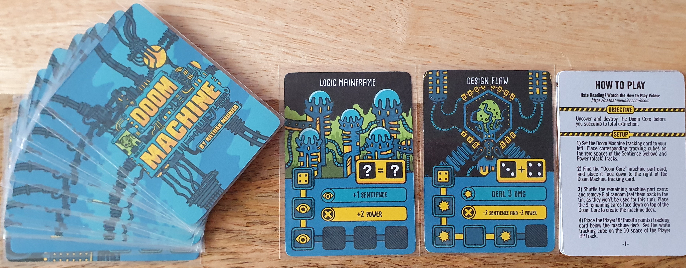
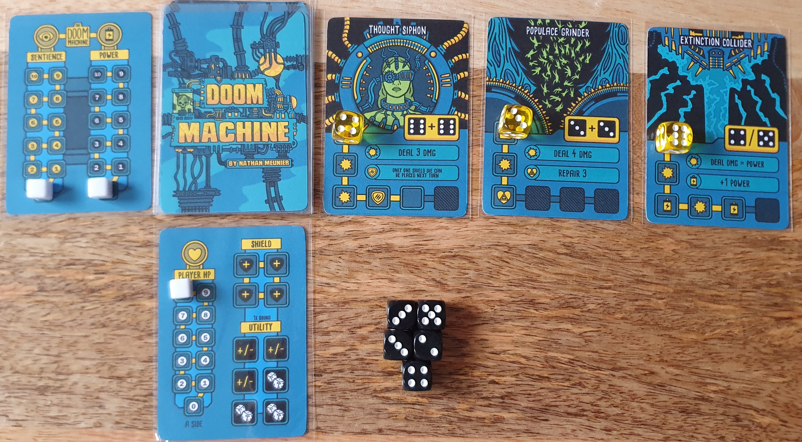
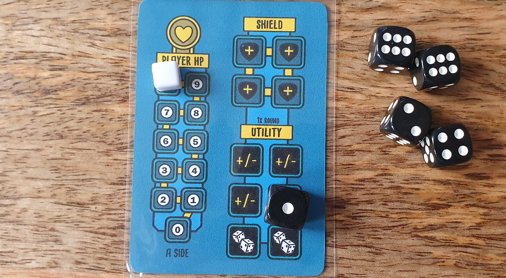
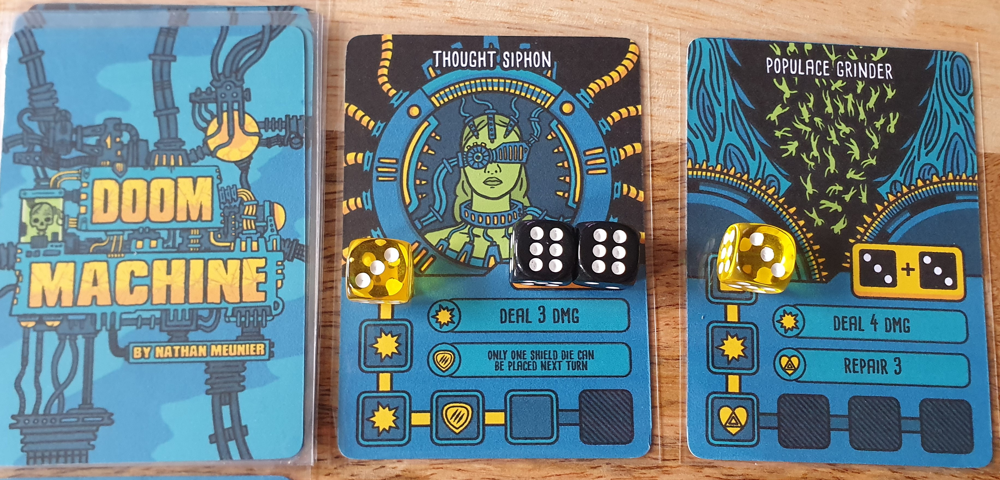
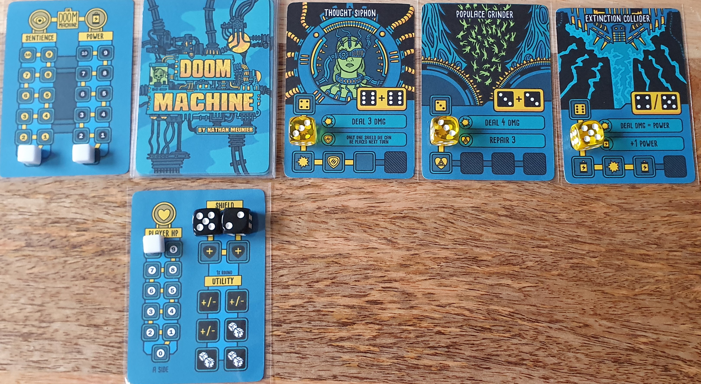
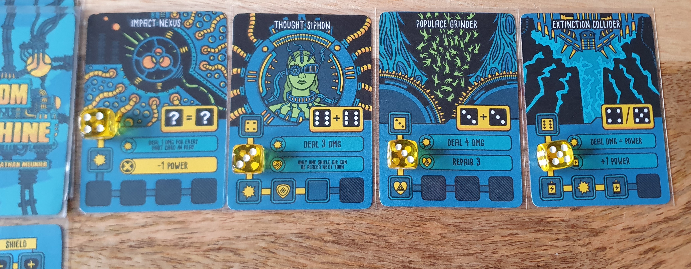
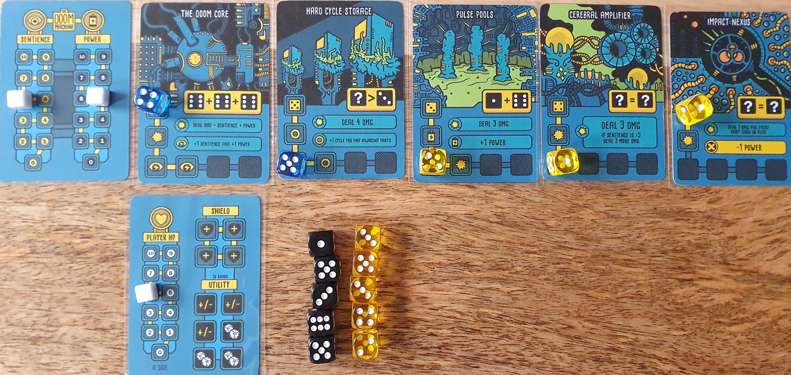
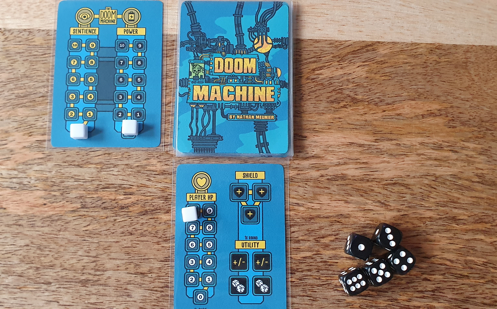

Bought from PNParcade [PNP Arcade](https://www.pnparcade.com/products/doom-machine) for $5.

Nathan Meunier really impressed me with Mindburners: Into The Void so when Doom Machine went on sale on PNPArcade I knew I needed to pick it up.

### Official Description

_Doom Machine is an intense pressure-cooker card and dice mint tin solo game experience that fits in your pocket. Face off against an ever-evolving, ever-growing machine of death and destruction! Find and defeat the doom core before humanity is annihilated._

### Components

Components include tin sized cards for the physical edition. While print and play has options for tin or poker sized cards. For print and play you will need at least 20 d6 along with three tracking cubes to track attributes.

### Gameplay

The aim of Doom Machine is to uncover the doom core and destroy it. But you need to survive parts of the doom machine until the core is uncovered. To do this you roll dice and place those to attack the active parts of the machine, while defending yourself to avoid running out of Health. This means that deciding which part to attack is your main strategic choice as some parts might do more damage in the short or long term, others can give good or bad impacts when destroyed. Meanwhile you also need to assign dice to shields to defend from incoming damage. Luckily the game makes it easy to calculate incoming damage as it is always predictable from the next action listed on active machine part tracks. Some parts will deal defined damage numbers while others will base it on the current level of sentience and power as tracked on the machine card. This results in a more impactful choices in the later game.

Due to this being a dice chucker there of course has to be a mechanic to reduce randomness. You have a choice at the start of each turn after rolling your dice to reroll some dice or modify dice to an adjacent value. The amount of dice you can impact depends on if you play the normal or hard mode. This also gives a great push your luck element as rerolling dice in the aim to get a value you want adds further risk.

Each machine part has a dice representing its health, once that reaches zero the machine part is removed from the game with its destruction effect activated. If you already have less than 10 dice you also can take the die from the machine part and add it into your pool. This gives a great sense of progression as more dice opens more opportunities.

After assigning your dice to machine parts and shields, the machine phase begins. This starts with each active machine part starting from the left part having its dice moved to the next action on the track, this action is immediately triggered causing the impact described on the part key due to different cards using the icons but with different impacts. If the dice moves off the end of the track it is moved back to the start. Once each part has been activated a new card is drawn from the machine deck and is added to the left edge of the part row. This part isn’t activated in the current turn so is only assigned a die with the next turn started after.

This predictability is great as it focuses the randomness on the dice and the potential interactions between each dice part. For example a machine part might trigger healing adjacent parts when it reaches one of its actions, so you might focus on destroying that part. Then the next part that gets drawn is a card that triggers adjacent parts multiple times, resulting in them speeding through their actions quicker. This results in you constantly having to adapt as new cards get added and others get destroyed.

### Reaching The End

Turns continue as described until the doom machine card is added to the row. As this is your goal you will win if you defeat the core, but you don’t need to defeat all other active parts. Letting you choose between continuing a slow burn or risking it to quickly kill the core. This is especially dangerous due to the high level of sentience and power that the machine has by this point of the game. With cards utilising those levels now being able to deal huge amounts of damage.

This is certainly a difficult game, though it only took a few attempts to win the game on normal mode. Hard mode on the other hand continues to elude me as this mode includes all machine parts in one game along with a more limited amount of re-rolls and modifiers allowed on each turn. But this has given me a great goal to aim for.

### Conclusion
