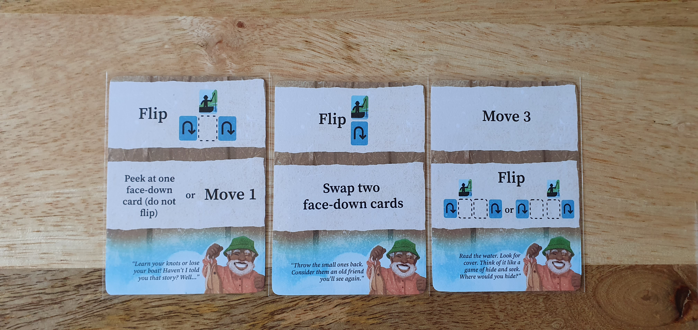

I reviewed the print and play version from [PNP Arcade](https://www.pnparcade.com/products/fishing-lessons) for $3 (I got it on sale for $2).

### Official Description

_It’s been a year since Leland Williams passed on. A year later, his family remembers his humor, warmth and – especially – his love of fishing. You play a member of his family going out on a solo fishing trip. With a specific sporting goal in mind, you’ll recall lessons and memories from Leland. If you piece together the lessons in just the right order, you’ll have a great day on the lake!_

### Components

Fishing Lessons consists of 18 cards like other Button Shy Games, with the physical edition coming in a wallet. Three cards are double sided character cards, with each character having a backstory and a unique gameplay goal. Seven cards are fish cards with one side having the same lake art and the other side having a unique combination of fish. Each fish has a name and a coloured letter which is used in the character goals. The final eight cards are lesson cards that each describe two actions you character must take during the activation step.

The art for the fish, characters and lake look great, but I felt that the font and goal letters looked out of place compared to the art style used elsewhere. Additionally the use of white boxes on the character cards seemed out of place and unfinished when in constrast to other Button Shy Games.

### Gameplay

// TODO
End goal depends on difficulty, each mode changes when you check if the goal has been reached. This goal is based upon the character you have chosen, these either require a certain number of fish symbols to be on the face up cards or a certain number of faceup fish cards.

// TODO
I found easy, way too easy but good for the first game as a way to teach the mechanics. Medium felt more satisfying and seemed like the mode that best fit the theme of using the lessons to fish. While hard requires you to go through all turns until the lessson deck is empty. While this does prevent luck from making it easy to win on an early turn, I didn't enjoy having to keep going through turns, even though from a thematic perspective I have found and caught the fish.

// TODO
At the start of the game you shuffle the lesson deck and draw three cards as your starting deck. Then you play a lesson card into the lesson row below the lake cards, these will be the actions completed by your character during the fishing phase.

### Expansions

At time of review only two expansions are currently available, Fabled Fish and Family Friends. Though more expansions are coming. I've yet to play these expansions, but I will update this review when I try them.

The Fabled Fish expansion adds four cards each with legendary fish that are added into the lake. One of these cards is sadded to the lake in each game, when reveleaed that fish has a special ability that is triggered.

The Family Friends expansion adds three new cards, with two being lessons cards that randomly replace lesson cards from the base game. With the third card being a double sided character card with new goals.

### Conclusion
