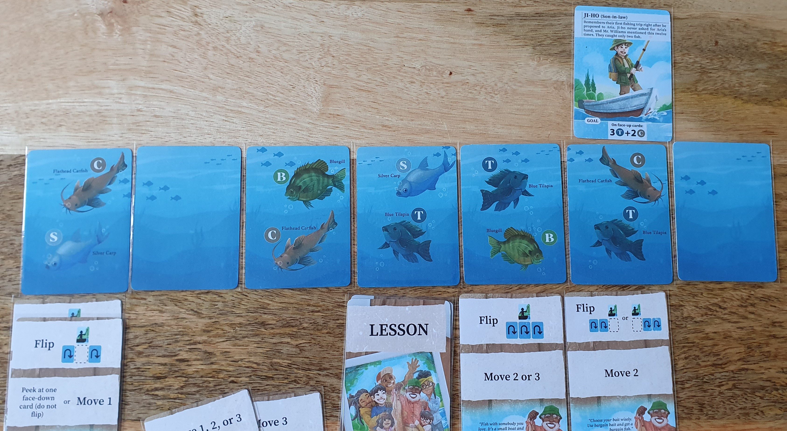
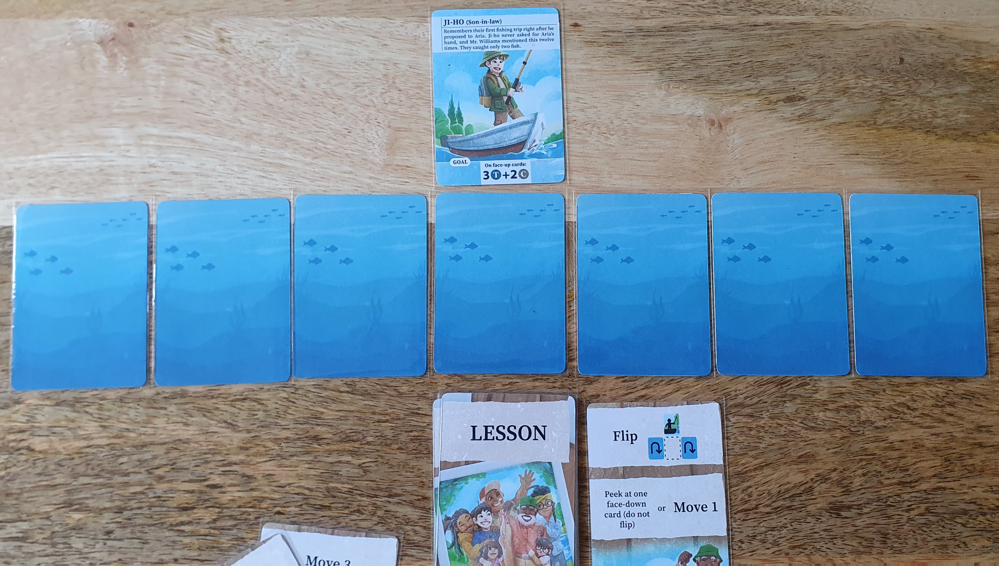
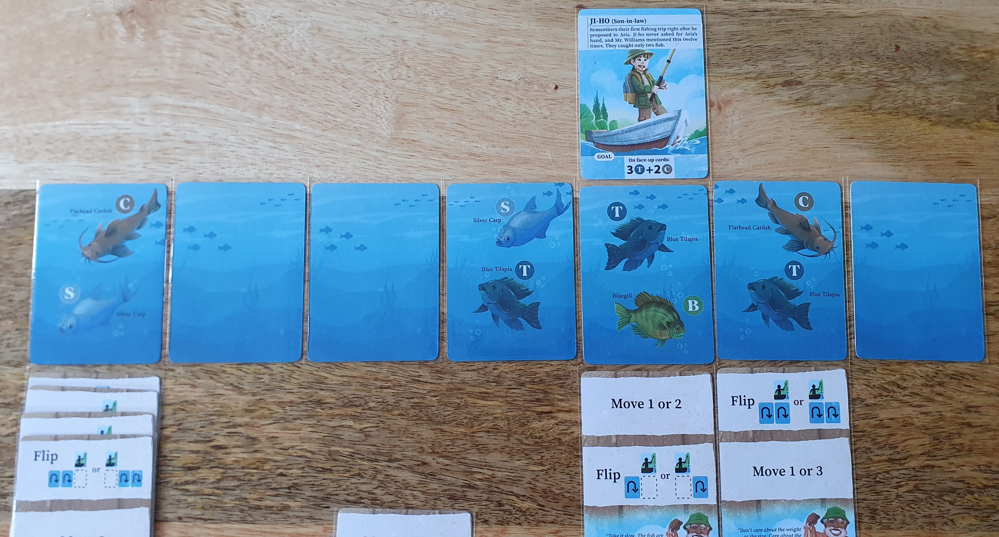
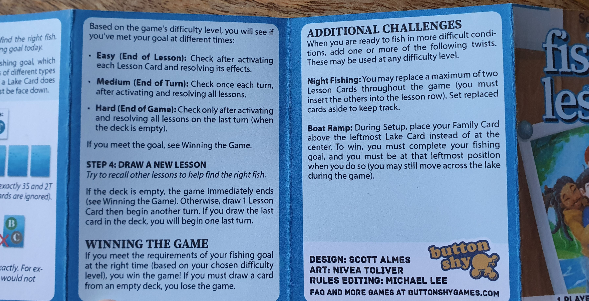

I reviewed the print and play version from [PNP Arcade](https://www.pnparcade.com/products/fishing-lessons) for $3 (I got it on sale for only $2).

Initially I wasn't sure about Fishing Lessons as I find games with programming mechanics a bit artificial with a painted on theme. But this one pleasantly surprised me and has become a go to game when I want a more complex yet small puzzle to solve.

### Official Description

_It’s been a year since Leland Williams passed on. A year later, his family remembers his humor, warmth and – especially – his love of fishing. You play a member of his family going out on a solo fishing trip. With a specific sporting goal in mind, you’ll recall lessons and memories from Leland. If you piece together the lessons in just the right order, you’ll have a great day on the lake!_

### Components

Fishing Lessons consists of 18 cards like other Button Shy Games, with the physical edition coming in a wallet. Three cards are double sided character cards, with each character having a backstory and a unique gameplay goal. Seven cards are fish cards with one side having identical lake art and the other side having a unique combination of two fish. Each fish has a name and a coloured letter which is used in the character goals. The final eight cards are lesson cards that each describe two actions you character must take during the activation step if played.

_Double sided character cards with their goals at the bottom_

The art for the fish, characters and lake look great, but I felt that the font and goal letters looked out of place compared to the art style used elsewhere. Additionally the use of white boxes on the character cards seemed out of place and unfinished when in contrast to other Button Shy Games.

### Gameplay

_Starting setup with the character in the middle of the lake_

Fishing lessons is game about programming actions in a certain order over multiple turns to achieve the goal on your chosen character card. Though when you can check that you have achieved your goal depends on the difficulty you have chosen before starting the game. Your character goal either requires a certain number of fish symbols to be on the face up cards or a certain number of faceup fish cards within the lake. This lake consists of 7 lake cards that your character moves left and right over with no movement beyond the left and right lake cards.

_First lesson card played with two actions to be completed from top to bottom_

At the start of the game you shuffle the lesson deck and draw three cards as your starting deck. Then you play a lesson card from your deck into the lesson row below the lake cards, these will be the actions completed by your character during the fishing step. The lesson card can be placed next to or replacing an existing lesson card, if replaced then the old card is discard out of the game. This makes it possible to remove cards that might have been useful early on to find the correct fish but that became a hindrance later on.

_End of actions after flipping the adjacent cards and moving one card to the right_

The fishing step involves activating the lesson cards from left to right until all are activated. These cards each have 2 actions with the top action activated first, some actions may give you a choice on the number of spaces your character can move or which fishing action can be completed. Fishing actions will flip faceup or facedown lake cards depending on where the action specifies. Because these lessons will be brought across each turn you have to plan into the future as bad decisions can have a long lasting impact. Building these movement and fishing combos is very satisfying, especially early on where you still have some turns of leeway available and are still trying to which cards have the fish you want.

_After another turn with a new lesson card added to the lesson row_

After completing all actions the next turn begins and you draw a new lesson card into your hand, with the turn continuing as before. The game ends when you either complete your goal according to the difficulty mode goal checking timing and your character goal or when the lesson deck is empty and you have completed the current turn.

_Later in the game with lesson cards replaced as the newer cards made it easier to attain the goal_

I found the easy mode way too easy but good for the first game as a way to teach the mechanics. Medium felt more satisfying and seemed like the mode that best fit the theme of using the lessons to fish. While hard requires you to go through all turns until the lesson deck is empty. While this does prevent luck from making it easy to win on an early turn. I didn't enjoy having to keep going through turns, even though from a thematic perspective I have found and caught the fish.

_Difficulty and challenge modifiers_

The two difficulty modifiers can be used on any difficulty and both add restrictions. Night fishing limits the number of lesson cards that can be replaced to two. I liked this modifier as keeping the active lesson cards down to only two was a strategy I used a lot without this modifier. So it forced me to engage more with programming my turns better.

The Boat Ramp modifier was different to play with at first but is clever for combining the theme and mechanics well. This modifier makes the character card start at the leftmost lake card which acts as the side you must enter and exit the lake from. Then you must also finish at the goal while at the leftmost lake card. I found this much harder as you are often forced to make fishing actions while returning to the left so programming lessons requires even more thought.

These modifiers are great for adding more variety and complexity as you get better at the game. After a few games I found that playing on medium with Night Fishing and sometimes Boat ramp was the most fun for me. As I'm not always in the mood for a brain burning game when playing smaller games.

### Expansions

At time of review only two expansions are currently available, Fabled Fish and Family Friends. Though more expansions are coming. I've yet to play these expansions, but I will update this review when I try them.

The Fabled Fish expansion adds four cards each with legendary fish that are added into the lake. One of these cards is added to the lake in each game, when revealed that fish has a special ability that is triggered.

The Family Friends expansion adds three new cards, with two being lessons cards that randomly replace lesson cards from the base game. With the third card being a double sided character card with new goals.

### Conclusion
