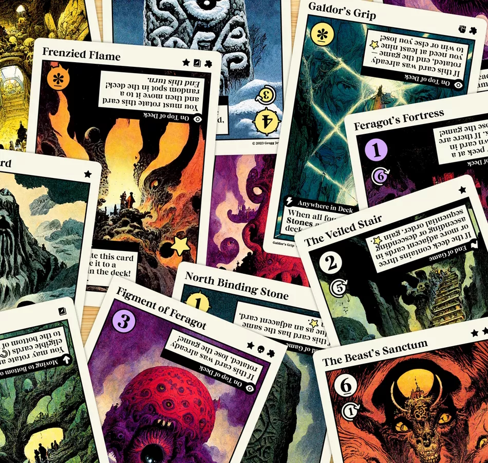

Only available as print and play. But was easy to print and has crosshair markers. Any misalignment is the fault of my lazy duplex print and play method.

### Official Description

_Galdor's Grip is a solo fantasy card game played entirely in your hands. Cycle through the deck, utilizing player actions and card abilities to strategically manipulate the order and orientation of the cards. Complete scoring objectives to earn enough points (stars) required to win the game, while avoiding any situations that result in a loss._

### Components

Base game has 18 cards with each expansion adding 6 additional cards. You combine the base and expansion cards to assemble a new deck for each game. The cards are extremely well produced for a free print and play game with fantastic art and iconography. As this is an in-hand game you need to choose the right sleeves or print and play method to make the cards easy to manipulate.

Each card has a name and art representing the obstacle or location.

// TODO
Value showing the number of cards that will be moved from the top to the bottom of the deck
Some cards can be flipped to get different effects or values

### Gameplay

All cards are face down at the start. Then you flip over the top card and resolve any effects.

ROTATE
CAN CHOOSE TO MOVE VALUE OF TOP OR NEXT CARD IF FACEUP

Next you move the specified number of cards to the bottom of the deck based upon the value of the top card. You can move the top card anywhere within the segment of cards being moved which is the main choice you need to make to win. Bad card orders can mean you miss flipping over face down cards or visiting negative cards. Being able to view the face up cards in the deck makes it easy to plan ahead.

The aim is to get 9 stars by the end of the game, these stars are earnt by having face up cards with stars on the top side. Cards with stars often require achieving certain orders of cards within the deck.

You also have to avoid repeatedly have the figment of feragot cards at the top of the deck. If this happens to the same of these cards three times then you automatically lose. Though flipping over these cards twice can earn a star so you can push your luck. I often found it quite hard to get nine stars with my average being 5 or 6.

### Expansions

Galdor's Grip has three expansions each containing 6 cards that can replace cards from the base game. This gives great replayability due to amount of possible card combinations. These expansions aren't required though, so I recommend printing out the base game first

### Conclusion
