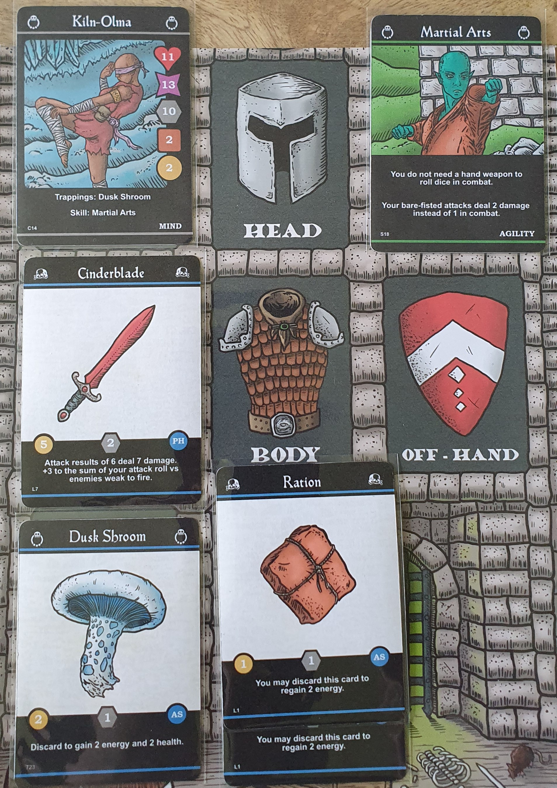

I reviewed the Print and Play version available from PNP Arcade for $5. But only some expansions are available for print and play.

### Official Description

_Iron Helm is a solo-play dungeon crawler in which you play as a hero in search of one last major score before finally hanging up the sword and retiring._

### Components

The print and play mostly consists of making cards but you can either make your own tokens or print out the card trackers from BGG with your own cubes to track, I prefered this to making all the tokens (I still had to make blessing tokens as there is no alternative). I recommend printing out the player mat if you get the PNP version to make it easier to track which weapons are equipped. I didn't see a need in printing the gameplay mat. If you play the print and play versions you will need to have d12 and d6 dice, along with small euro cubes if you use the tracking cards.

The Game Crafter physical edition comes with all the base game cards, along with tokens and dice in a box with dividers and is large enough to fit some expansions. I think this version is expensive for what it is ($54.99 at time of review) especially compared to traditionally published games due to how The Game Crafter works. It is even more expensive if you live outside the USA due to taxes and shipping, so be carefull as many people have mentioned how expensive the game is with all costs considered.

The Game Crafter also separately sells game and player mats to make laying out the game easier and more thematic. I don't think this is essential but I did like using a printed player mat in my PNP version.

### Gameplay

Iron Helm aims to give dungeon crawler experience with character progression, plot, and random encounters in a relatively small package compared to large dungeon games.

First you pick one of the four base game characters and start with the skills and trappings assigned to that character, along with tracking the starting health, energy, rations listed on the character card. Each character plays differently as archetypal fantasy classes with the biggest impact being the main type of skills the character can upgrade with. Though any character can upgrade with any skill, just at a higher cost.

I used the printed tracking cards from BGG instead of using tokens as this felt cleaner and quicker to use.

Next you start exploring the dungeon which consists of turns encoutering the surprises within the dungeon. At the first of each turn you play two facedown dungeon cards from the top of the deck. Then pick one and flip it face up, if you don't like the first card then you can push your luck and pick the other card.

Dungeon cards can often have 2 effects depending on which order the card was picked with the second effect being stronger. Avoiding the first card you picked can be disaterous if you flip over a skirmish or poison trap. This gives great push your luck gameplay, where you might avoid a dangerous encounter to end up in a worse encounter. Though remembering which cards you have already discarded can help judge if flipping over the second card is worth it.

The dungeon encounters can be enemies, merchants, campsites and many others with positive or negative impacts. This means you never know what will be behind the card. An issue I had with One Deck Dungeon another small dungeon crawler. If you encounter an enemy, then you start combat which must be completed before you can continue exploring the dungeon.

Combat is dice based with your damage modified by equipment and skills. This combat is very simplistic but is only part of the gameplay so I didn't feel it dragged down the game as a whole. The card that triggers the combat will impact enemy health and initial damage meaning that choosing the fight if your first dungeon card is a combat encounter can the difference between life and death.

Each enemy also has an additional effect such as trading resources to avoid combat or other impacts if the enemy hits you.

The encounter turns continue until you reach the end of the dungeon deck or reach ten plot points on your plot cards. You then shuffle the dungeon deck, increase the dungeon level, lose a ration if available and increase your poison. This dungeon level impacts combat, making it more dangerous as you delve deeper, working great with the theming.

After completeting the other parts of the dungeon level completion, you then draw a plot card from the plot deck. These plot cards give choices with many possible impacts. Each plot card has a value, once you have discarded enough plot cards to sum 10 or more you then encounter the boss. The dungeon cards are reshuffled, a ration is reduced and potion is increased if you have it. This means you need to keep resources available as running out will be dangerous. The dungeon tracker card is used to track which level of the dungeon you are on.

Some plot cards impact or use the player's morality to give different options or effects. This helps feel like you are actually roleplaying within this world, while being a small additional mechanic. Having high morality generally gives better long term impacts if you draw a plot card that uses your morality level, but choosing a morality lowering option often helps you keep alive. Though I did have many games where I had drawn a plot card that used morality before I had actually had a chance to lower or increase my morality, often making that plot card feel unimpactfull.

Blessing tokens can be gained during the dungeon and are placed with your player face down so that you do not know what is on the other side. During combat you can discard a blessing token to reroll a single combat roll. But if you keep tokens until you reach the boss, you can flip the tokens over and gain their effects. This can be healing, additional energy or removing poison.

The boss is picked based upon the enemies you fought during the dungeon. Bosses are just enemies with higher stats so combat is played as normal.

I generally found the game quite hard with enemies able to inflict large amounts of damage in a single hit and easy to run out of energy if you get too aggressive with attacks.

This is an example of a game I lost, where the boss only had 2 health left but its counterstrike dealt 9 damage (5 from dice difference added with 4 lich base damage) killed me.

### Game End

If you kill a boss you can end the game there and score based upon what you achieved. There are expansions available that you play after completing a dungeon keeping the same character as before allowing for campaign gameplay.

I always like games with clear win/loss game ends, especially when you are building a character within a world. Having additional score gives extra replayability by making a difference between games that you just managed to scrape a win compared to a win where everyting thing went right for you.

### Expansions

The Loot and Lore pack adds new characters, plot cards, enemies and items. This is combined with a base game to expand its content. I found this really improved the content variety.

Additional adventure expansions are also available to add campaign gameplay. These adventures are brought into the game after completing a certain number of previous dungeons. Each adventure has a new boss, enemies, character and items. 6 are available on gamecrafter though only 4 are currently on PNP arcade.

There is also the Iron Chest expansion https://www.thegamecrafter.com/games/iron-chest which is only available physically. This adds a new adventure pack, mechanics, items, and random encounters. I've yet to try this expansion due to the cost of importing games from The Game Crafter into the UK.

### Conclusion
