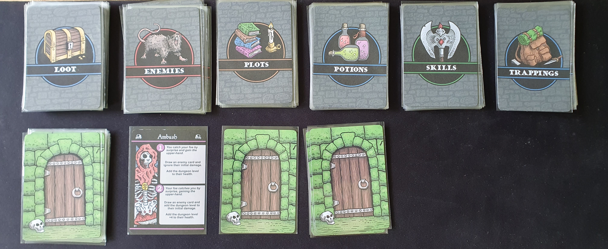

I reviewed the Print and Play version available from PNP Arcade for $5. But only some expansions are available for print and play.

### Official Description

_Iron Helm is a solo-play dungeon crawler in which you play as a hero in search of one last major score before finally hanging up the sword and retiring._

_Iron Helm uses a draw two, pick one mechanic, that has the player draw two cards from the dungeon deck, reveal one, and then decide to either resolve the revealed card, or take their chances with the unknown._

_Players will start the game with some coin that they can spend to equip themselves for the adventure. Once inside the dungeon they will encounter nasty foes, discover treasures, unlock plot cards, and ultimately face a dungeon boss._

_Along the way you will learn new skills and upgrade your character with new items. You will have to manage your health and energy levels, while trying to avoid hazards like getting poisoned or lost in the labyrinth._

### Components

The print and play version mostly consists of making cards but you can either make your own tokens or print out the card trackers from BGG with your own cubes to track, I prefered this to making all the tokens (I still had to make blessing tokens as there is no alternative). I recommend printing out the player mat if you get the PNP version to make it easier to track which weapons are equipped. I didn't see a need in printing the gameplay mat. If you play the print and play versions you will need to have two d12 and at least three d6 dice, along with small euro cubes if you use the tracking cards.

The Game Crafter physical edition comes with all the base game cards, along with tokens and dice in a box with dividers and is large enough to fit some expansions. I think this version is expensive for what it is ($54.99 at time of review) especially compared to traditionally published games due to how The Game Crafter works. It is even more expensive if you live outside the USA due to taxes and shipping, so be carefull as many people have mentioned how expensive the game is with all costs considered.

The Game Crafter also separately sells game and player mats to make laying out the game easier and more thematic. I don't think this is essential but I did like using a printed player mat in my PNP version.

### Gameplay

Iron Helm aims to give dungeon crawler experience with character progression, narrative events, and random encounters in a relatively small package compared to large dungeon crawl games.

First you pick one of the four base game characters and start with the skills and trappings assigned to that character, along with tracking the starting health, energy, and rations listed on the character card. Each character plays differently as archetypal fantasy classes with the biggest impact being the main type of skills the character can upgrade with. Though any character can upgrade with any skill, just at a higher cost. This gives a good amount of variation; though some skills seemed more consistently useful compared to others that required rarer events to be useful.

I used the printed tracking cards from BGG instead of using tokens as this felt cleaner and quicker to use. Most actions are going to involve tracking these character attributes.

Next you start exploring the dungeon which consists of turns encountering the many surprises within the dungeon. At the first of each turn you play two facedown dungeon cards from the top of the deck. Then pick one and flip it face up, if you don't like the first card then you can push your luck and pick the other card.

Dungeon cards can often have 2 effects depending on which order the card was picked with the second effect being stronger. Avoiding the first card you picked can be disasterous if you flip over a skirmish or poison trap. This gives great push your luck gameplay, where you might avoid a dangerous encounter to end up in a worse encounter. Though remembering which cards you have already discarded can help judge if flipping over the second card is worth it.

The dungeon encounters can be enemies, merchants, campsites and many others with positive or negative impacts. This means you never know what will be behind the card. Certain skills and items can modify some of the encounters nullifying or reducing their negative impacts on you. If you encounter an enemy, then you start combat which must be completed before you can continue exploring the dungeon.

Enemy health scales based upon the dungeon level and whether it is a skirmish or ambush card, this does mean the game gets harder further into the dungeon. Though the damage is consistent which can mean you can take large amounts of damage early on especially with tougher enemies. Combat is dice based with your damage modified by equipment and skills. This leads into my main issue of the combat being too basic with equipment and skills only allowing for re-rolls or modifiers. Offensive potions can be used instead of using energy to attack or you can attack for one damage without spending energy. Thought I didn't find any of these combat options particularly compelling as it mostly felt like trying to trade blows with the enemy as quick as possible with limited strategy. Though as combat is only a part of the gameplay I didn't find it a deal breaker.

Each enemy also has an additional effect such as trading resources to avoid combat or other impacts if the enemy hits you. This gives extra flavour to the encounters and encourages being cautious with resources as they may be useful in other ways. Such as using rations to avoiding fighting wolves or giving gold to avoid fighting an ogre.

These encounter turns continue until you reach the end of the dungeon deck or reach ten plot points on your discarded plot cards. You then shuffle the dungeon deck, increase the dungeon level, lose a ration if available and increase your poison if high enough. This means you need to keep resources available as running out will be dangerous. The dungeon level impacts combat, making it more dangerous as you delve deeper, working great with the dungeon theming. Though you won't see any new content deeper in the dungeon, I do wish more of these small card based dungeon crawlers such as One Deck Dungeon would have additional encounters that only get added after each dungeon level.

After completing the other parts of the dungeon level completion, you then draw a plot card from the plot deck. These plot cards give choices with many possible impacts. Each plot card has a value, once you have discarded enough plot cards to sum 10 or more you then encounter the boss. The dungeon tracker card is used to track which level of the dungeon you are on. One issue I had as that the plot card values are inconsistent, so bad luck with the cards can make the game drag on. Making your chances of having enough health and energy to combat the boss less likely.

Some plot cards impact or use the player's morality to give different options or effects. This helps feel like you are actually roleplaying within this world, while being a small additional mechanic. Having high morality generally gives better long term impacts if you draw a plot card that uses your morality level, but choosing a morality lowering option often helps you keep alive. Though I did have many games where I had drawn a plot card that used morality before I had actually had a chance to lower or increase my morality, often making that plot card feel unimpactfull.

Blessing tokens can be gained during the dungeon and are placed with your player face down so that you do not know what is on the other side. During combat you can discard a blessing token to reroll a single combat roll. But if you keep tokens until you reach the boss, you can flip the tokens over and gain their effects. This can be healing, additional energy or removing poison. I found the healing from these very important, especially if I got unlucky with health potions draws from the potion deck after getting enemy encounter rewards or buying from the merchant.

The boss is picked based upon the most common enemy type you fought during the dungeon. Bosses are just enemies with higher stats so combat is played as normal. Knowing which enemies you encountered during the dungeon can help you prepare weapons and items that gain benefits when fighting the expected boss enemy type. Such as potions that deal increased damage to undead enemies.

I generally found the game quite hard with enemies and bosses able to inflict large amounts of damage in a single hit. With it being easy to run out of energy if you get too aggressive with attacks. So I would often get skills so that I could avoid skirmishes or risk choosing the second dungeon card as otherwise I would end up with low health by the time I got to the boss, with limited opportunities to heal up.

The example above shows a game I lost, where the boss only had 2 health left but it made a counterstrike that dealt 9 damage (5 from dice difference added with 4 lich base damage) which killed me. As there are no campaign/legacy systems without the adventure expansions, if you die nothing is carried over across games. So losing to unexpectedly very high damage can feel anticlimatic.

### Game End

If you kill a boss you can end the game there and score based upon what you achieved, with thematic home flavour text given based on the score boundaries. There are expansions available that you play after completing a dungeon keeping the same character as before allowing for campaign gameplay. As these are available via Print and Play, I was printing adventure expansions once I completed the game with the previous expansion.

I always like games with clear win/loss game ends, especially when you are building a character within a world. Having an additional score gives extra replayability by making a difference between games that you just managed to scrape a win compared to a win where everyting thing went right for you.

### Expansions

The Loot and Lore pack adds new characters, plot cards, enemies and items. This is combined with a base game to expand its content. I found this really improved the content variety as it is always applied to the base game.

Additional adventure expansions are also available to add campaign gameplay. These adventures are brought into the game after completing the base game and previous adventure expansions. Each adventure has a new boss, enemies, character and items. Six are available on gamecrafter though only four are currently on PNP arcade. These help give variety and seemed to have a slightly higher difficulty, though I do wish there was more to the experience between dungeons during a campaign. As you only reset attributes and have the opportunity to buy trappings. I would have liked more events to help build the narrative as you only get a small sentence of flavour text when starting the next dungeon.

There is also the Iron Chest expansion https://www.thegamecrafter.com/games/iron-chest which is only available physically. This adds a new adventure pack, mechanics, items, and random encounters. I've yet to try this expansion due to the cost of importing games from The Game Crafter into the UK.

### Conclusion
