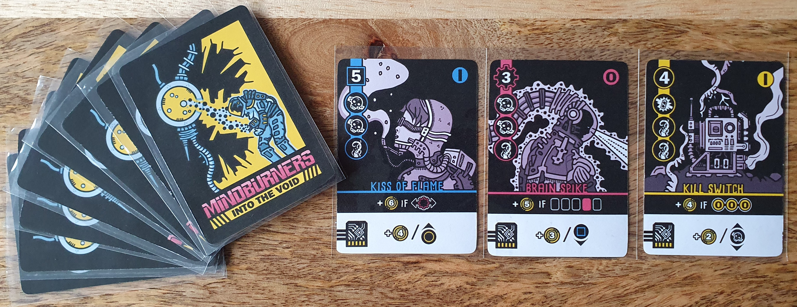

I reviewed the Print and Play version available from PNP Arcade for $4.50.

### Official Description

_Mindburners: Into the Void is a strategic cyber-occult card drafting and arrangement game for 1-2 players. Loaded up with experimental gear and thrust into the swirling chaos beyond against your will, you must equip and optimize your limited void-tech and outperform your adversary._

### Components

Mindburners: Into the Void consists of 18 cards each containing great art and theming along with a suite with a base value, symbols, binary value, basic ability and install ability.

### First Draft

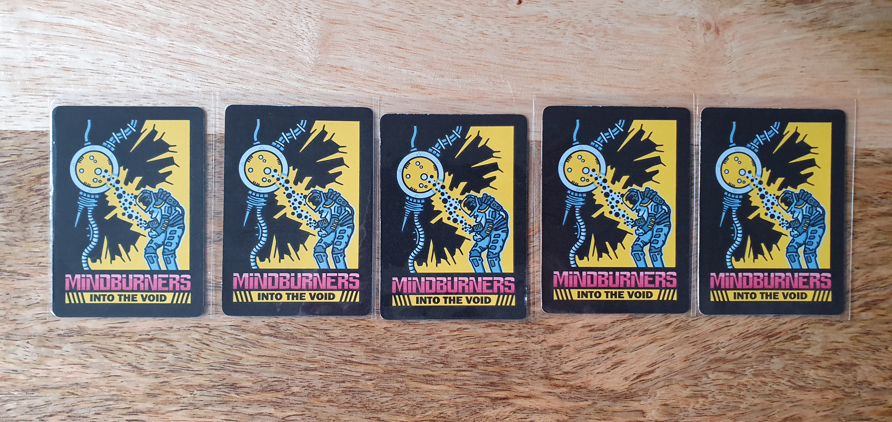

To start you shuffle the deck and draw 5 cards keeping them facedown. Then give one to start the AI’s tableau.

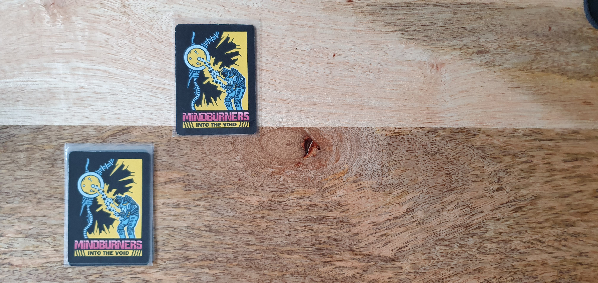

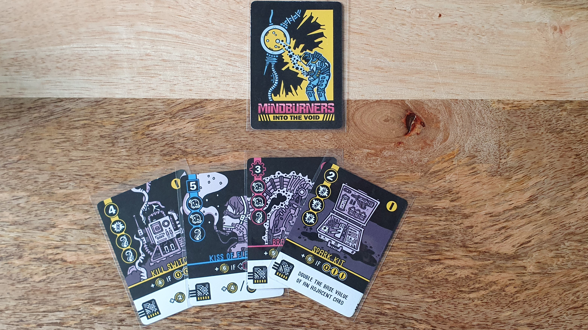

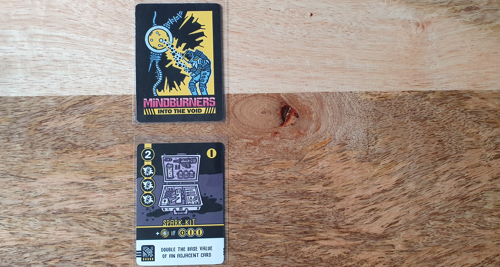

Next you can look at the drawn cards and pick one to add to your tableau. You can ignore the basic abilities positioning requirements as you are able to reorder your cards once both rounds of drafting are completed. After adding your card, you then flip the drawn cards to be facedown and shuffle them. Then again giving a random card to the AI’s tableau.

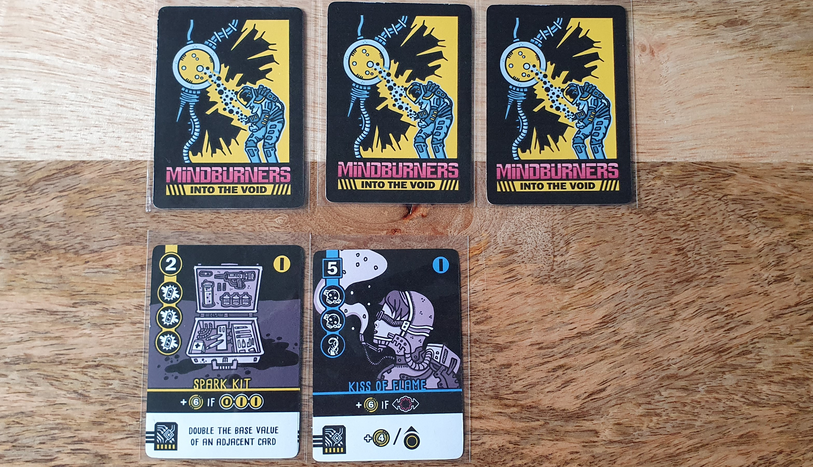

These previous steps are continued until all 5 of the drawn cards are assigned to tableaus. Resulting the the AI having 3 cards in their tableau.

### Second Draft

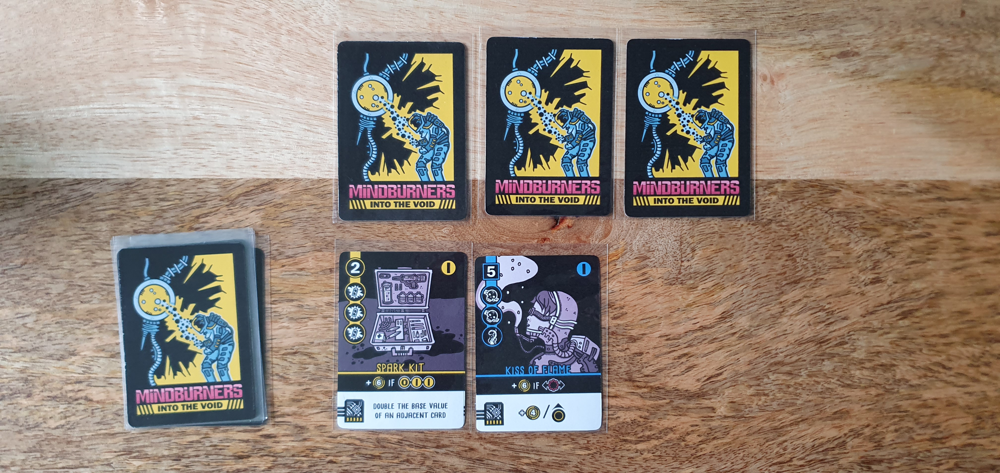

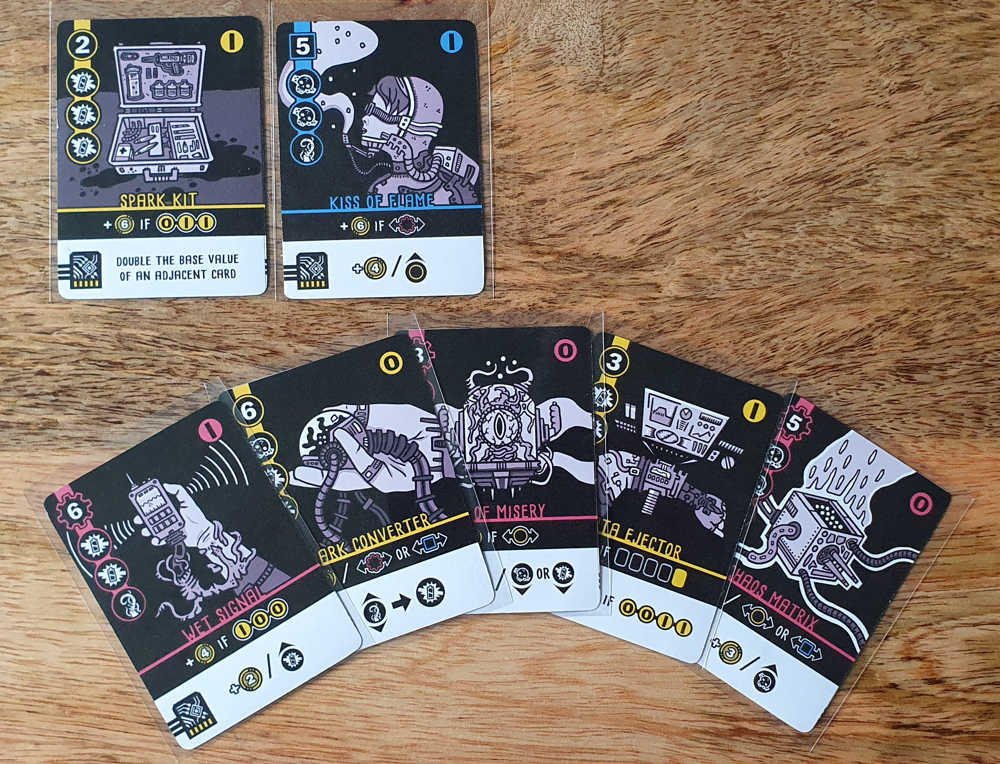

With both draft’s halfway done you normally have a good idea about which tableau combos you are aiming for by this point. This second draft is the same as the first draft with the change being that you get to choose the first card. This continues until you and the AI’s tableaus have 5 cards each.

### Ordering and Installing Cards

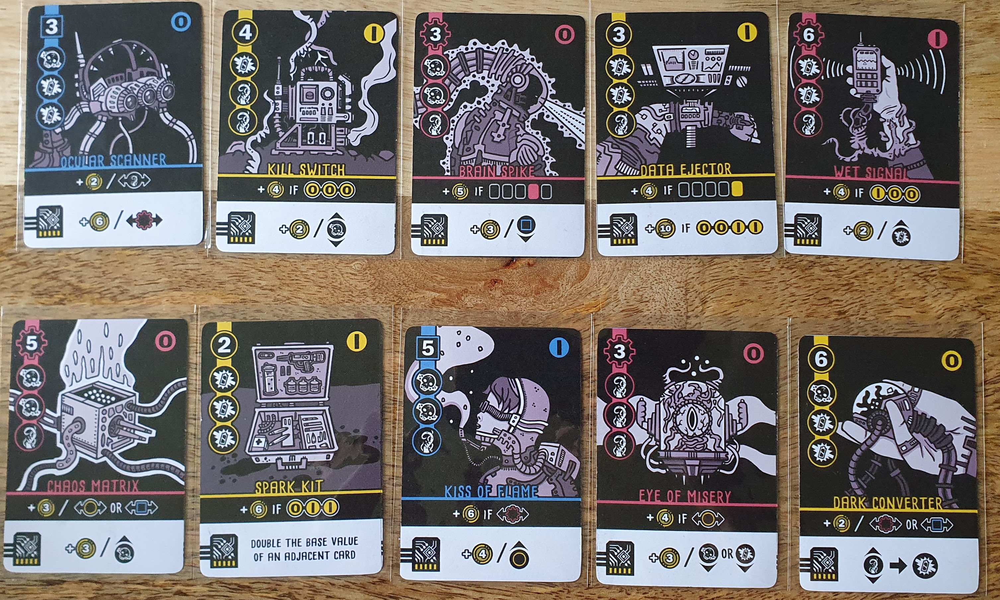

Now that you and the AI have a full tableau of five cards, you can freely reorder your tableau to maximise scoring. This feels great due to the amount of scoring options on each card. With the basic abilities combining well with the card suites, binary and symbols.

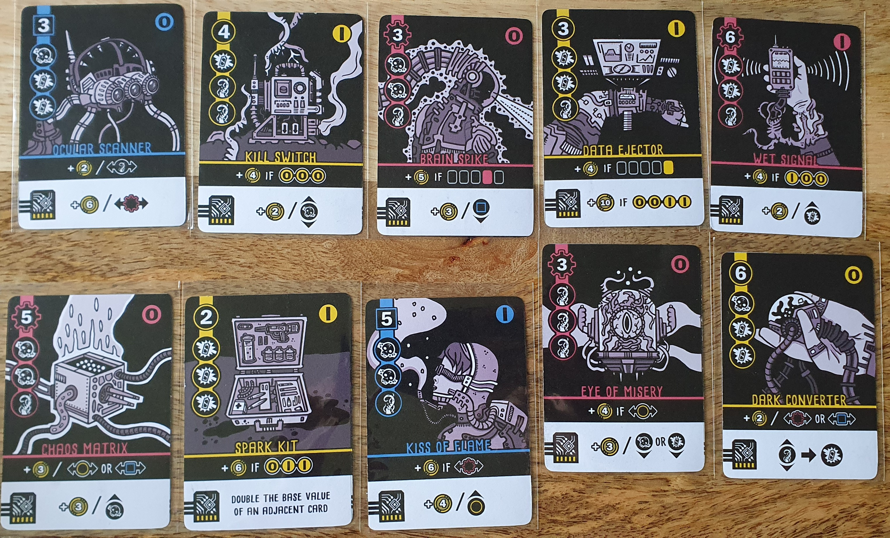

Along with reordering you then need to choose two cards to install. An installed card gains additional points based upon its scoring criteria in the bottom white section of the card. This criteria can be impacted by another of the other card mechanics, allowing for some combos though it did seem limited in number.

I did feel that the installed card criteria was often less interesting than the basic abilities. With one card having a fixed additional score meaning it didn't have any way to combo with other cards.

### Scoring

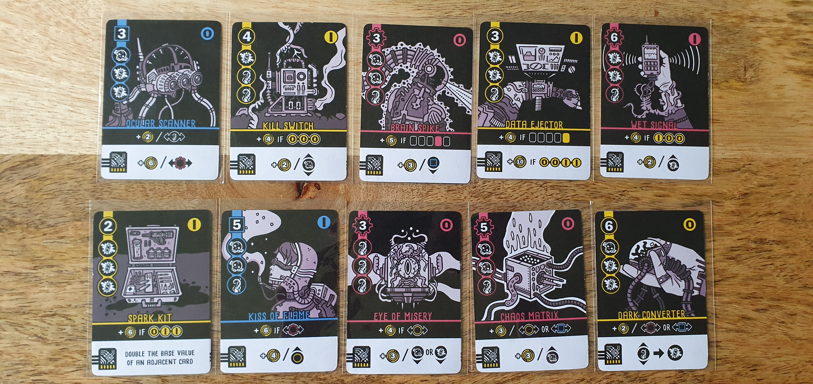

With a slight change to scoring to accommodate that the AI cannot place cards effectively. This does make it harder than 2 player, but I found that even if I got similar scores between multiple games, the AI score would fluctuate a lot. Making it feel less satisfying to get the win as I didn’t feel like I earned it.

To get a good score you really have to get good drafts to maximise the basic abilities with installed cards giving you the extra edge needed to win.

### Theme

As with Nathan Meunier's other games this continues to have great art and theming along with very readable iconography. The binary and installation mechanics were the standout thematic mechanics for me.

### Conclusion
