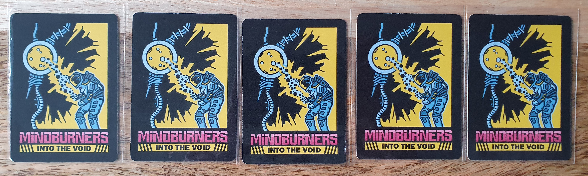
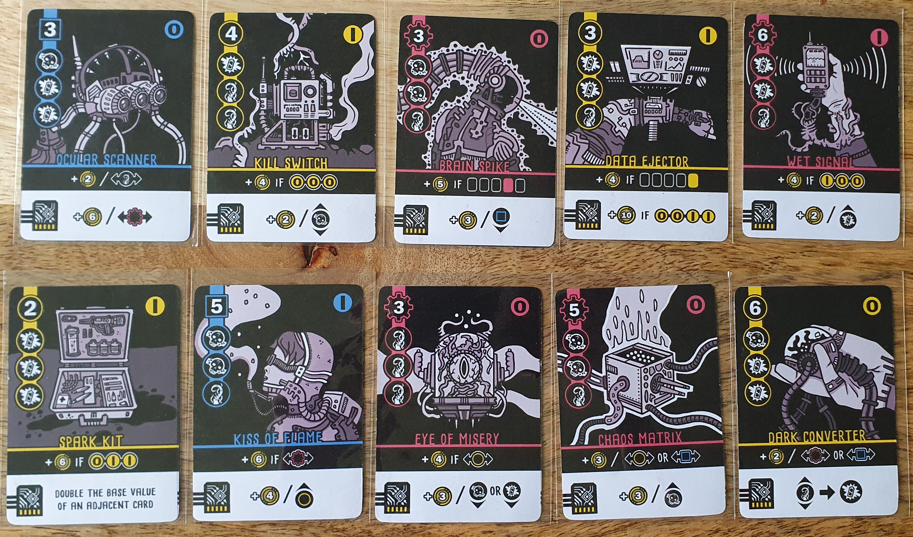

I reviewed the Print and Play version available from PNP Arcade for $4.50.

### Intro

Tableau builders are one of my favourite genres and Mindburners: Into the Void has cemented its place as one of my go-tos. This was also my first Nathan Meunier games and have since started collecting more due to the impression this one left one me.

### Official Description

_Mindburners: Into the Void is a strategic cyber-occult card drafting and arrangement game for 1-2 players. Loaded up with experimental gear and thrust into the swirling chaos beyond against your will, you must equip and optimize your limited void-tech and outperform your adversary._

### Components

Mindburners: Into the Void consists of 18 cards, each containing great art and theming along with a suit, base value, symbols, binary value, basic ability and install ability. It is print and play only exclusively on PNP Arcade with no print on demand copies available.

It can be played with 1-2 players with this review focusing on the solo AI, though the game is very similar in both.

### First Draft

During the game you build a tableau of five cards which then get scored after both drafts have been completed. The player with the highest score wins.

The solo mode is similar to the 2 player mode but with the AI always taking the first turn in the first draft. The solo mode consists of two drafts followed by the equipping and re-ordering phase then scoring.

To start you shuffle the deck and draw five cards keeping them facedown. Then give one to start the AI’s tableau.

Next you can look at the drawn cards and pick one to add to your tableau. After adding your card, you then flip the drawn cards facedown and shuffle them. Then again giving a random card to the AI’s tableau.

These steps are continued until all five of the drawn cards are in the tableaus. Resulting in the AI having three cards in their tableau while you have two cards.

By this point you should have a good idea of what tableau combos you are aiming for and thinking about what cards the AI has.

### Second Draft

The second draft is the same as the first draft with the change being that you get to choose the first card. This continues until you and the AI’s tableaus have five cards each.

Once all cards have been assigned you will next need to think about how to maximise the score with your cards.

### Ordering and Installing Cards

In the solo mode the AI cards are flipped over once both drafts have been completed, with AI scoring completed before you can configure your tableau.

Next, you can freely reorder your tableau to take advantage of abilities and binary combinations. This feels great due to the amount of scoring options on each card. With the basic abilities combining well with the card suites, binary and symbols.

Along with reordering you then need to choose two cards to install. An installed card gains additional points based upon its scoring criteria in the bottom white section of the card. This criteria can be impacted by another of the other card mechanics, allowing for some combos.

I did feel that the installed card criteria was often less interesting than the basic abilities. With one card having a fixed additional score meaning it didn't have any way to combo with other cards.

### Scoring

Scoring has a slight change compared 2 player to accommodate that the AI cannot place cards effectively. This does make it harder than 2 player, but I found that even if I got similar scores between multiple games, the AI score would fluctuate a lot. Making it feel less satisfying to get the win as I didn’t feel like I earned it. With it being more based on the randomness of the AI than any of my choices. Though to get a good score you really have to get good drafts to maximise the basic abilities with installed cards giving you the extra edge needed to win.

### Conclusion
