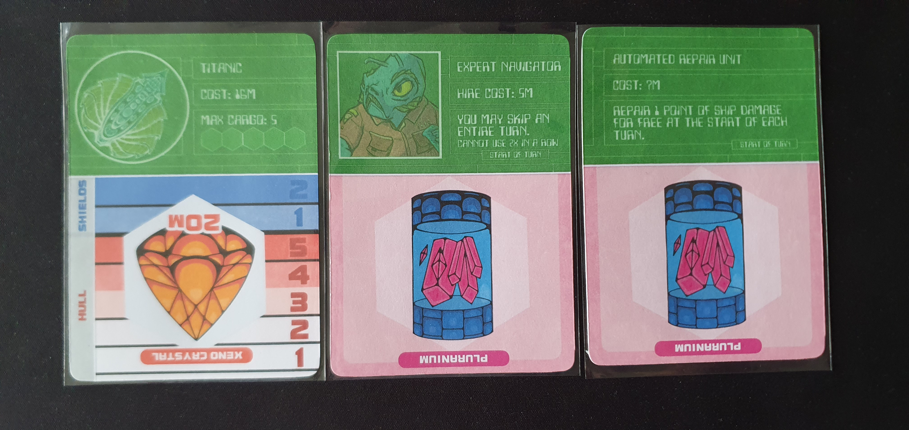

I reviewed the print and play version from [PNP Arcade](https://www.pnparcade.com/products/spaceshipped) for $3.

### Official Description

_A solo space trading game of buying and selling resources, upgrading your ship, crew, and equipment, dealing with pirates, and making deals. A card game with over 30 random events, 4 types of ship, 4 sets of crew members, and 8 different pieces of equipment to install, all using only 18 cards packed neatly in a little wallet._

### Components

SpaceShipped consists of 18 cards with 16 being multi-use and the other two being tracking cards. Each of the multi use cards has content on both sides. One side having the orbital encounter, planetside encounter and marketplace with the other side having an upgrade and resource. These are some of the most content rich cards I've seen in a Button Shy Game.

### Gameplay

The aim of SpaceShipped is to buy two xeno crystals before your opponent takes them. This time limit encourages risky choices that balance between making enough credits and surviving into the next turn. To buy a xeno crystal you need 20 credits obtained by buying and selling resources without reaching 0 health.

Each turn consists of activating the effects of the current encounter cards going diagonally from the top left of the left card down to the bottom right of the right card. First you activate the orbital encounter of the left card which can be positive or negative, though you have no way to prepare for this encounter which you will see is a big negative for my enjoyment of the game. Next you have the planetside encounter of the middle card which acts the same as the orbital encounter. Though you have a turn to prepare as the encounter cards are shifted to the right after each card with the right card being moved into the upgrade row and the rightmost resource card being flipped and added as the left card of the encounters. Being able to prepare for the planetside encounter is important as you often need to prepare shields or buy certain resources to avoid damage.

Next you can buy and sell from the marketplace and upgrade row. The right card in the encounter is the marketplace, this gives two turns to see what prices you can get in the future for buying and selling.

The upgrades row will have an assortment of ships, crew and ship upgrades. Expensive ships will have more inventory slots which are important later as you need space to contain any resources and xeno crystals you have. This row also shifts to the right each turn with the rightmost card becoming the next resource card. This gives multiple turns to prepare to buy upgrades. Upgrades become very important in avoiding negative encounters and maximising profits.

The resource row has a wide assortment of resources available so you normally have opportunities to buy low and sell high, with the occasional turn where you don't have any profitable choices. Those turns are often a good opportunity to buy upgrades.

All of these mechanics come together well in giving a space merchant experience where you are hopping planet to planet buying and selling resources. The issues though comes from the randomness of each mechanic that when combined can ruin a game instantly. For example I had a turn with a 3 damage orbital encounter that I couldn't prepare for, followed by a 2 damage planetside encounter that could have only be mitigated if I had a resource that hadn't been available to buy at a decent price recently. Because you can only have a max of 3 health and 2 shields this means that one turn of bad luck can instantly end the game. The other effect of this means you can get really good combinations of turns with a profitable marketplace but it this ends up being unsatisfying as it is rarely due to any good choices you made.

### Expansions

I've yet to try any of the four expansions but they each add new cards that replace cards from the base game. Adding more variety and difficulty.

### Solo Challenges

The [Button Shy Games' Discord](https://discord.com/invite/aUBMvnu) runs occasional solo challenges for SpaceShipped. With these challenges applying custom modifiers to how you play or complete the game giving additional difficulty.

### Conclusion
