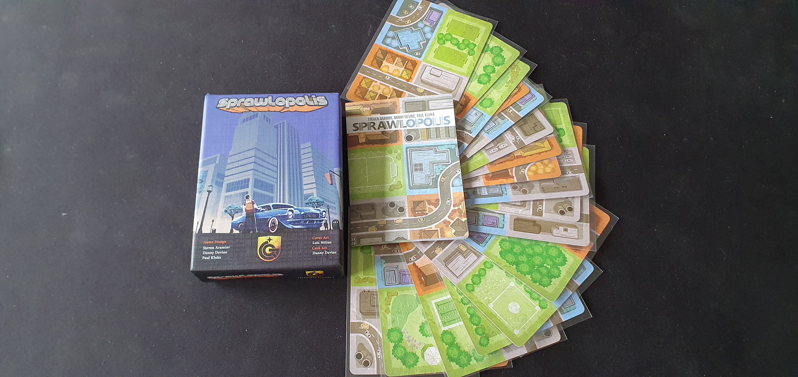
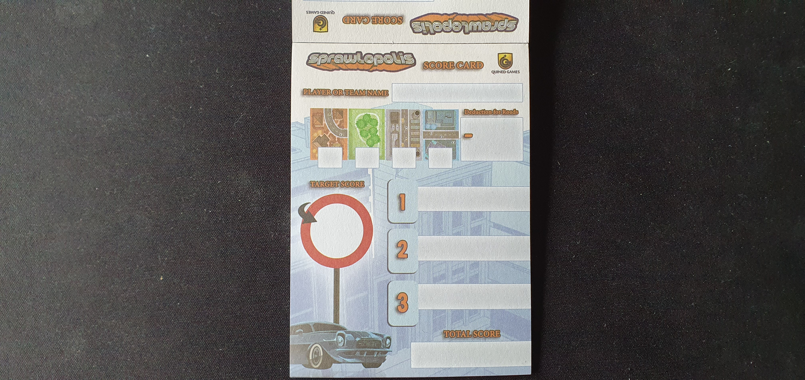
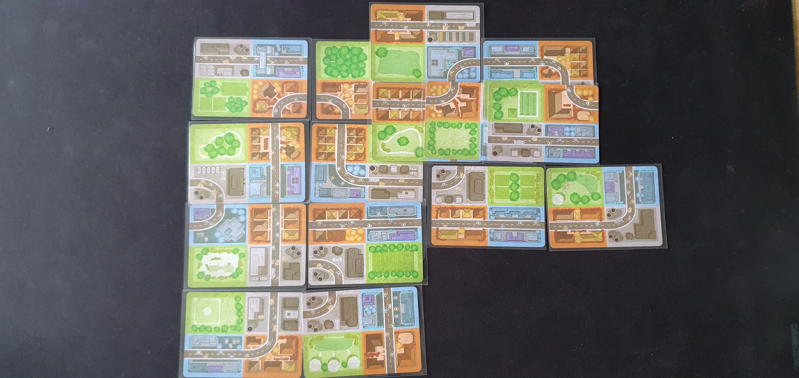
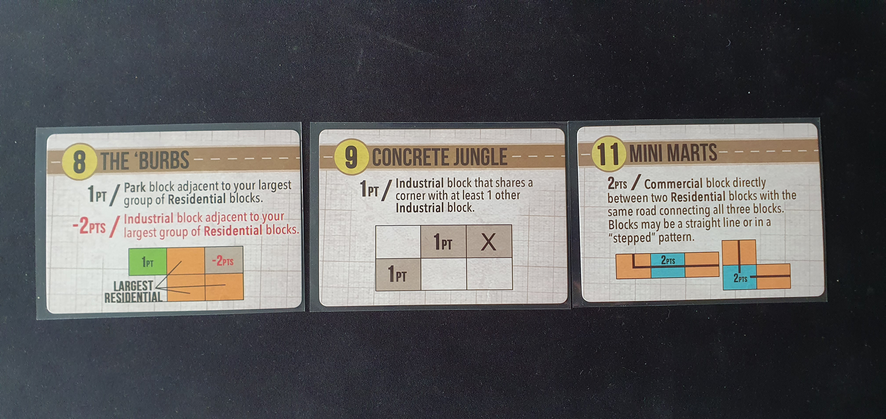
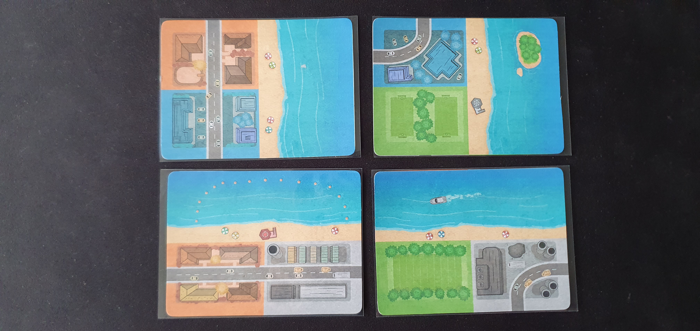
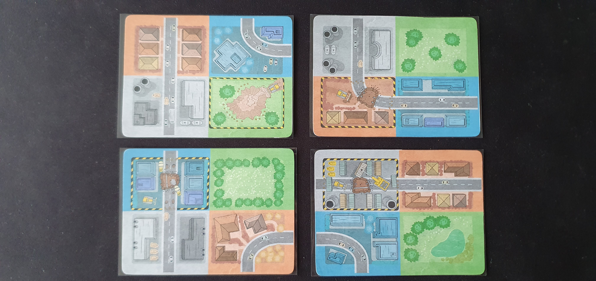
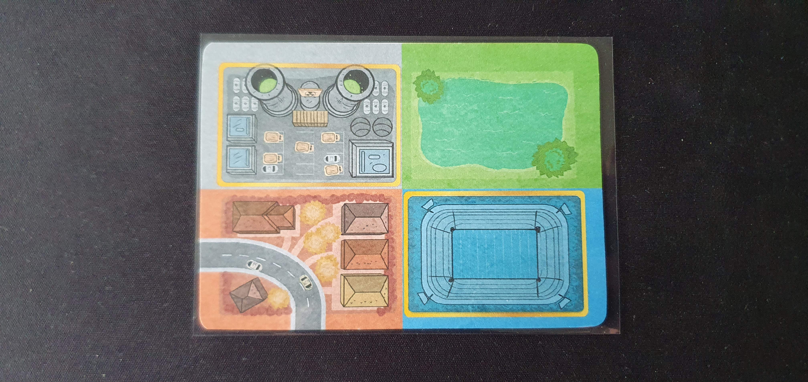
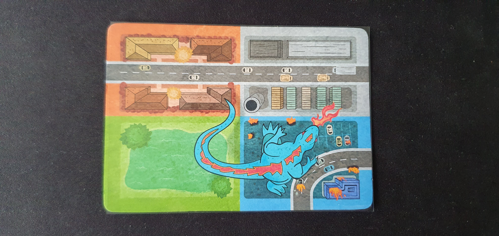
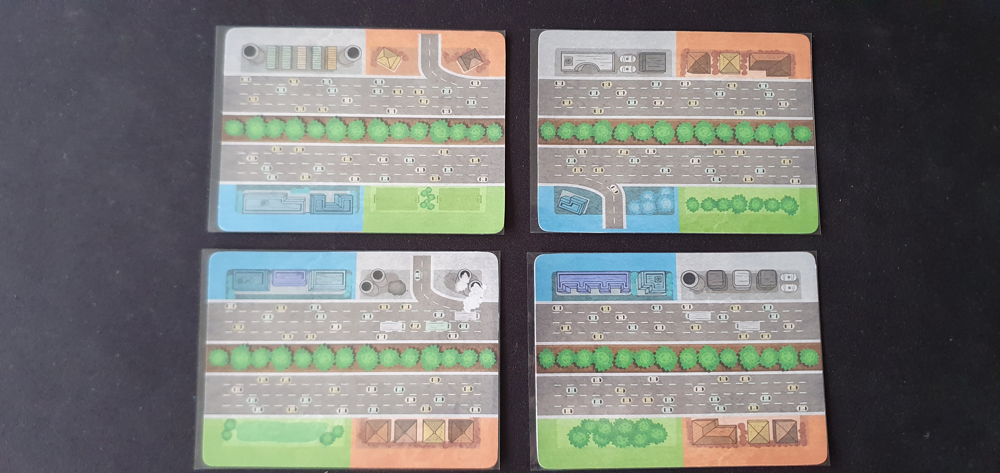

I reviewed the [Quined Games](http://xmedia.quined.nl/shop/sprawlopolis/) version that I bought from [Zatu Games](https://www.board-game.co.uk/product/sprawlopolis/). I then printed out the expansions from PNPArcade. This review primarily covers the solo mode as it's the recommended way to play according to the BoardGameGeek community.

### Official Description

_In Sprawlopolis, 1-4 players work together to build a new city from the ground up. Using only 18 cards and a variable scoring system, the game is never the same twice. Each turn, players will play 1 card from their hand to the growing city, trying to score as many points as possible._

### Components

Sprawlopolis like other Button Shy Games, consists of 18 cards. With one side showing a set of four city blocks each of a different type. Along with one or two roads. The other side has a scoring condition. It also comes with scoring pad to help with scoring.

### Gameplay

In solo mode you shuffle the deck of cards and draw the top three to act as scoring cards. You use the scoring sides of these cards as your main scoring objective during gameplay. The scoring side includes the target score which get summed up across all active scoring cards to become your target score which if equalled or beaten by your own score then you win. These scoring conditions can sometimes work together well and make it easier or encourage opposite gameplay styles making it harder.

Next you draw three cards from the deck to become your starter hand. This starts the main gameplay where you play a card from your hand and then draw a new card until all cards have been played. When you play a card it must be placed with an adjacent edge or partially/completely covering an played card (outside of the first turn). This means you slowly build up a city with a layout you choose based upon the randomness of the deck order and the scoring cards you drew. This is very simple to learn while feeling satisfying and giving a huge amount of possible options during gameplay. When you play cards you can also rotate them 180 degrees giving additional options especially when trying to connect roads or building larger groups.

Once all cards have been played you start scoring. This involves adding together the number of blocks within your largest group for each group type. Then you minus a score for each separate road, this encourages building a city that makes more thematic real sense with large connected roads and different sections of your city. Next you calculate your score for each active scoring card, this can involve getting adding or minusing points for certain block and road placements. Once all of your scores have been summed you get your final score. This is then compared to the target score (sum of all active scoring card targets). This gives you a win/loss goal with additional aim of beating your same score if you happen to have the same scoring cards as a previous game.

### Beaches Expansion

Beaches adds cards that restrict the area you can build in by creating a horizontal or vertical limit that you cannot build past. But offsets this difficulty increase with an additional scoring card also pulled from the beaches cards. This is my favourite expansion as it works great thematically and mechanically.

### Construction Zones Expansion

Construction Zones adds cards that get played during gameplay when they get drawn into your hand. Each card contains a block with construction on, if this block is not covered by the end of the game you additional lose points. Like beaches you also offset this difficulty increase with a scoring card from this expansion. This didn't quite hit the same as Beaches as it felt more annoying than fun.

### Point of Interest Expansion

Points of Interest adds a single card that you place first before starting gameplay. Both sides of the card has city blocks so you can choose which blocks would work best with your scoring conditions. The yellow bordered blocks are points of interest that will gain you a point per adjacent block of the same time. This encourages building a central group of the same block type. The expansion adds extra points making the game easier without additional complexity, but I still like sometimes using it because I feel that the game lacks the thematics of special buildings within the city.

### Wrecktar Expansion

Wrecktar adds difficulty by being played when it gets added to the hand. This card covers the last card that was played and then reduces the final score if any commercial blocks are in the same row and column. If you avoid doing that you get 3 extra points. While having a Godzilla like creature attacking your city is a great idea, I felt that the mechanics were lacking. Instead I would have preferred additional cards with military blocks that must be placed in the same row and column to take Wrecktar down.

### Interstate Expansion

Interstate is the most unique expansion, but works best in multiplayer where you can play versus another player building your own city on your side of the interstate. The interstate is built horizontally between both players and includes roads that turn off onto your city. Each interstate card also includes half city blocks at opposite sides these cannot be covered but otherwise act as normal city blocks for scoring.

The issue in the solo mode is that you alternate between building each side of the city. Which I just didn't find fun as splitting up the playable cards limits the size and possible layouts of each side.

### Other Expansions

I've yet to try the Roadworks expansions, but will update this review once I've done so. The combo expansions are also available to combine Sprawlopolis with Agropolis and Naturopolis.

### Conclusion
