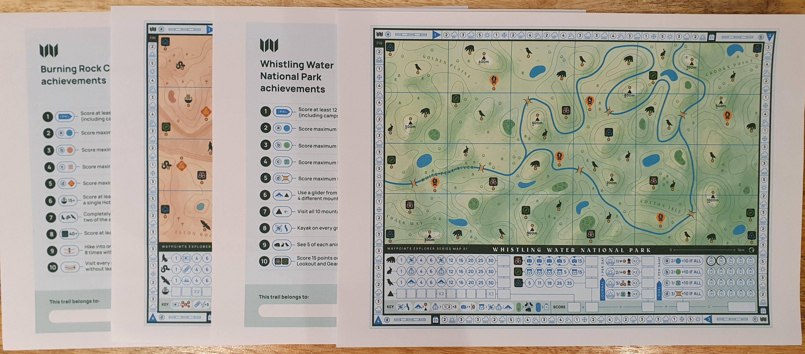
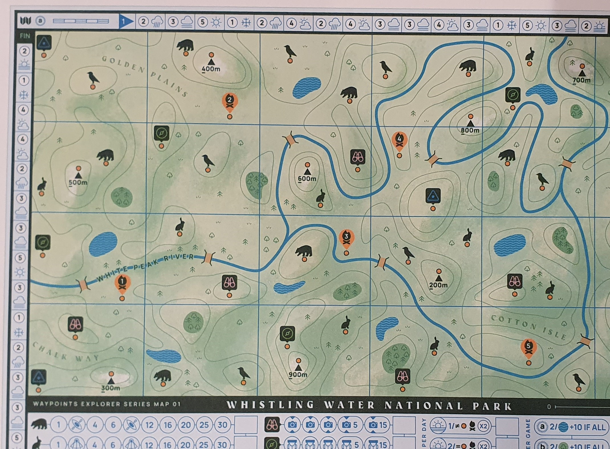
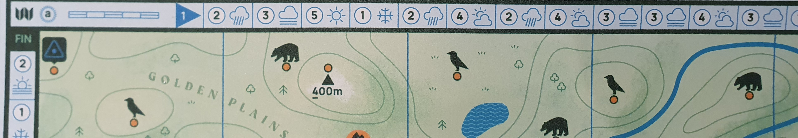
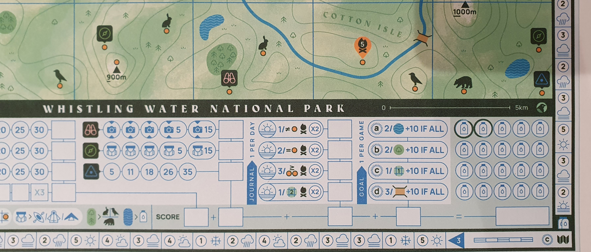
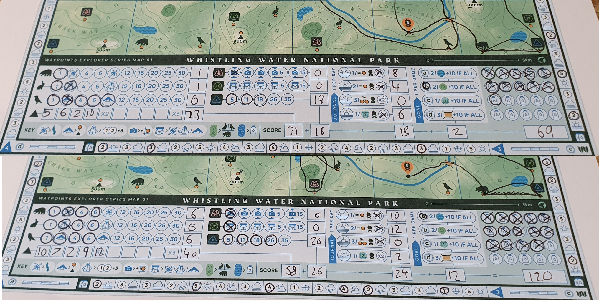
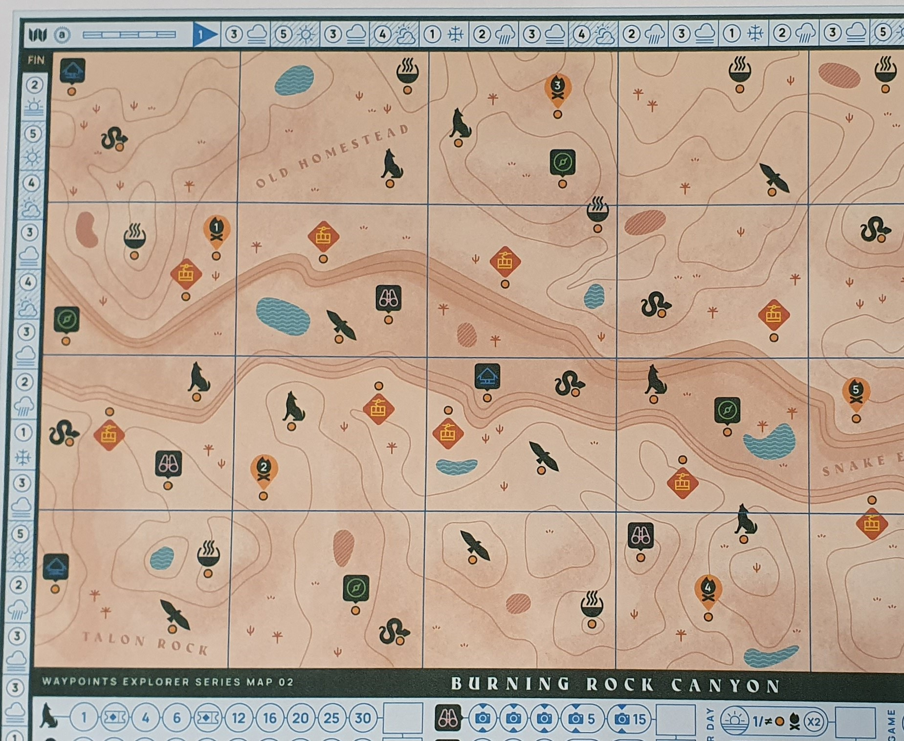
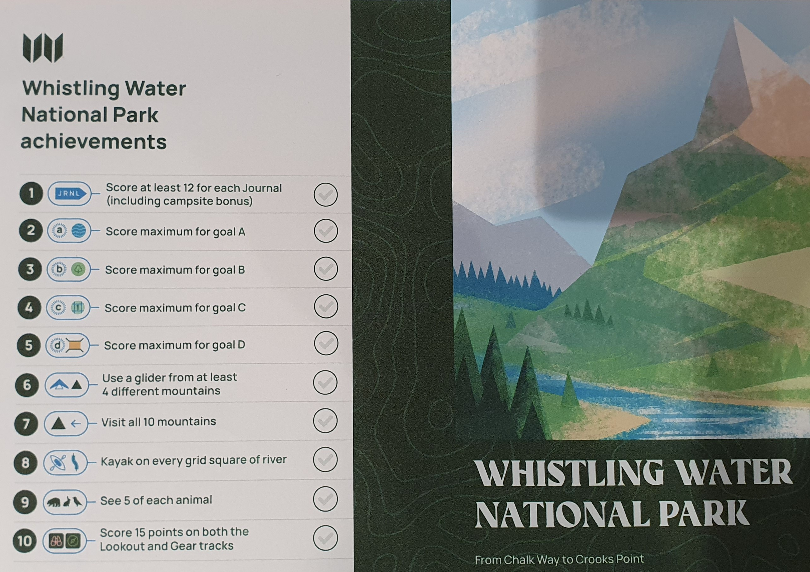

Bought Waypoints directly from [Postmark Games](https://www.postmarkgames.com/waypoints) for £4.

Waypoints was my first roll and write which has certainly set a high bar for the next games that I try, a perfect combination of theming, art and meaningful decisions.

### Official Description

_Battle the elements in Waypoints as you hike through a landscape of mountains, valleys, lakes, and woodlands. Climb vast summits or take to the rivers, marking your route and recording your experiences as you go._

### Components

Waypoints like others from Postmark Games are only available for print and play. Currently you get access to two maps each with their own mechanics and achievements, with more planned for the future without additional cost. You can either write directly on the printed sheets or laminate them, though I prefer keeping the sheets to look back on in the future. Any number of players can play, though you will need a sheet for each player.

### Gameplay

As the name suggests, Waypoints is a roll and write about exploring a map while visiting waypoints. Waypoints can be the top of mountains, animals, campfires, and more; with each providing various scores and functional benefits.

Each game starts with randomly selecting a special scoring condition for this game that adds some extra points based on your actions. The mechanics and scoring can differ between the current two maps, but the core mechanics stay the same. With each game consisting of four hikes each ending with a scoring goal you choose from the journal, while all other scoring is completed at the end of the game.

Each hike involves rolling a die and following the weather condition at that spot on the hike weather tracker until you reach the end of that tracker. These weather conditions limit how many contour and grid lines you can cross on that turn, this means that planning is essential. With many hills, mountains and rivers impacting your routes as you need to start at the previous waypoint and end on a new waypoint within that distance.

The topographical map is effective thematically and makes deciding your routes interesting as many rolls can have many options. Though you can get stuck due to bad planning such as being on the top of a hill or mountain without a glider or coat while bad weather limits your movement.

To negate the impact of weather you can use a water bottle to add an extra line movement to your turn. Water can be gained from lakes and completing each of the four hike earns two, so keeping a good supply of water available becomes a great decision with a push your luck element where you might use more water now to risk requiring good weather in the next few turns.

In each hike you can decide which journal to score. This lets you plan your scoring as you may know that you will use a kayak or explore a flatter area within this hike. Ending at a campfire also doubles this journal score making it valuable in your final score.

Once all four hikes are complete you total up your scores and compare who got highest. As you can see below the scores can vary depending on your luck with weather and whether you make some bad choices.

### Maps

Map 1 "Whistling Water National Park" is the map that has been shown above and includes lakes, mountains, hills, rivers and forests. Use gliders to move from mountains to nearby waypoints and kayaks to navigate the rivers (not quite sure how hiking to bears gives you a kayak).

Map 2 "Burning Rock Canyon" has a large canyon along the middle which severely restricts movement between the top and bottom sections. This time sun is also a concern as you need to seek shade while hiking during extremely hot weather. Hot springs replacement mountains, but instead you score based on the number of lines crossed to reach the spring in that turn. Cablecars can also be used to navigate the canyon. The differences in additional mechanics and scoring really demonstrate how great of a system this game is, with gameplay meshing well with the map themes.

Map 3 is coming in the future, though there is no word on when outside of it being worked on according to the Postmark Games' Discord server.

### Modes

Waypoints can technically be played with any number of players. In multiplayer you share the rolls so it is up to player decisions to see who gets the best score. While iIn the solo mode you can do a high score, but the variability of the dice rolling means your scores won’t exactly be balanced between games. In this mode there is an additional challenge of needing to end your hikes on a new campfire on 3 out of the four hikes. While on hard mode you need to finish on all 5. This makes planning your route super important, as not having a coat while being far away from the nearest campfire can be a disaster on the first map.

### Achievements

Each map has a list of 10 achievements that can be completed during the game, these add extra replayability with additional goals for you to complete instead of just aiming for higher scores.

### Conclusion
